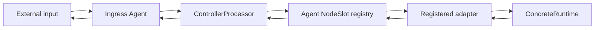

# P4 구현 명세 v5

P4(Proxy Pipeline Parallel Protocol)는 외부 ingress, Controller, agent, 논리 NodeSlot, 모델 deployment binding, concrete inference adapter를 분리한다. native hidden state·KV cache·GPU handle·llama.cpp private ABI는 P4 payload가 아니다.

## 논리 객체

| 객체 | 지속성 | 책임 |
| --- | --- | --- |
| External caller | 연결 단위 | HTTP/WebSocket/Kafka 등으로 ingress agent에 요청을 전달한다. |
| ControllerInstance | 논리 ID | 외부 API 클라이언트이며 adapter endpoint나 worker를 알지 못한다. |
| ControllerProcessor | agent 내 논리 역할 | ingress를 수용하고 누락 session ID를 발급하며 deployment binding을 대상으로 실행한다. |
| Agent | 머신 단위 | hardware/adapters/NodeSlot registry, lifecycle relay, ingress를 보유한다. |
| NodeSlot | agent-owned marker | 자원 책임과 adapter handle을 가진 모델 독립 logical node다. 구상 process일 필요가 없다. |
| ModelBinding | 반복 가능 | deployment/model/partial-plan 결과와 runtime generation을 NodeSlot에 연결한다. |
| Adapter | 독립 구현 경계 | concrete runtime 생성·재사용·교체·언로드와 backend option filtering을 선택한다. |



에이전트와 컨트롤러 역할은 하나의 Rust process에 공존할 수 있다. 이는 transport 최적화일 뿐 논리 책임의 합병이 아니다. `p4-agent`는 기본적으로 물리 CPU 코어 수의 두 배에 해당하는 Tokio worker thread와 공통 태스크 큐를 사용하며, `--workers 1..1024`로 이를 명시할 수 있다. 상위 처리기는 로컬 상태를 갱신하고 후속 태스크를 발행한 뒤 종료하며, 원격 I/O와 호환 어뎁터 호출은 큐 워커 밖에서 수행되고 그 결과가 응답 태스크로 재진입한다.

## P4B1 v5 서브프로토콜

16-byte `P4B1` header의 version byte는 `5`다. payload 앞에는 `u32 route_id 길이 + route_id UTF-8 + u64 deadline_unix_ms`가 붙고 그 뒤에 메시지 payload가 온다. `route_id`는 transport stream identity이며 업무 `request_id`/`operation_id`와 독립적이다. 따라서 여러 ControllerInstance가 같은 업무 ID를 써도 한 연결에서 충돌하지 않는다. `deadline_unix_ms=0`은 기한 없음이다. v5는 v4와 wire-compatible하지 않으며 frame은 최대 1 MiB다.

모든 메시지는 하나의 정적 카탈로그에서 요청·확인·진행·이벤트·종료·오류, correlation key, control/prefill/decode/response 큐, 허용 통신 방향을 정의한다. 에이전트 내부 `TaskEnvelope`는 `task_id`, `route_id`, `deadline_unix_ms`, `correlation_id`, `causation_id`, source/target participant와 네 가지 P4 통신 방향을 포함한다. 상세 계약은 [`docs/task-runtime.md`](docs/task-runtime.md)다.

| 축 | 요청 | 결과 | 의미 |
| --- | --- | --- | --- |
| 인벤토리 | `INVENTORY_QUERY` | `HARDWARE_REPORT` | agent가 OS, CPU parallelism, NVIDIA GPU UUID/name/total/free VRAM/driver, registered adapter와 slot snapshot을 controller에 제공한다. |
| 어뎁터 | `ADAPTER_REGISTER` | `ADAPTER_REGISTERED` | local adapter가 agent에 ID/kind/endpoint/descriptor를 self-register한다. |
| 노드 | `NODE_CREATE` | `NODE_CREATED` | controller가 registered adapter로 모델 없는 NodeSlot을 생성한다. `node_spec`은 adapter-owned opaque JSON이다. |
| 모델 | `MODEL_LOAD` | progress/draft/`MODEL_BOUND` | partial model plan으로 binding을 준비한다. adapter는 concrete runtime을 새로 만들거나 재사용할 수 있다. |
| 모델 | `MODEL_UNLOAD` | `MODEL_UNBOUND` | binding만 제거한다. NodeSlot은 남는다. |
| ingress | `INGRESS_SUBMIT` | `INGRESS_ACCEPTED` | agent가 session을 확정하고 대상 NodeSlot의 execution credit을 확보한다. |
| 실행 | `EXECUTE` | `TOKEN*`, `DONE`/`ERROR` | exact NodeSlot/deployment/binding/generation만 실행한다. |

`HEALTH_CHECK`은 NodeSlot의 현재 adapter/runtime 상태를 probe한다. `DRAFT_REPORT.ffn_bytes=0`은 미분류를 뜻하며 FFN 0 byte 주장이 아니다.

## 모델 적재와 실행의 분리

`NODE_CREATE`에 model, layer range, context, sampling policy를 넣지 않는다. NodeSlot은 empty 상태에서 health와 lifecycle 요청을 수신할 수 있다.

`MODEL_LOAD`는 `deployment_id`, `binding_id`, `model`, `plan_revision`, `stage_plan`을 가진다. 같은 NodeSlot에서 다음 순서는 유효하다.

```text
NODE_CREATE(node-a) -> ready-empty
MODEL_LOAD(binding-a, model-A, plan-1) -> ready generation=1
MODEL_UNLOAD(binding-a) -> ready-empty
MODEL_LOAD(binding-b, model-A, plan-2) -> ready generation=1
MODEL_LOAD(binding-c, model-B, plan-3) -> adapter policy decides coexist/replace
```

모델 적재마다 partial placement plan이 달라도 된다. adapter는 `stage_plan`을 해석하며 P4 agent/controller transport는 해석하지 않는다. `stage_plan.load_options`에는 flash attention, mmap, KV cache 형식/offload, NodeSlot별 동적 배치 상한과 그 계산 근거를 담고 `adapter_options`로 구상 런타임 전용 설정을 전달한다. 정식 스키마와 실측 기반 계산식은 [docs/model-load.md](docs/model-load.md)에 고정한다. `EXECUTE`는 `binding_id`와 `runtime_generation`을 반드시 제시한다. 따라서 stale session이 재적재된 concrete runtime을 오동작시키지 않는다.

## concrete backend 경계

| Adapter | NodeSlot 생성 | ModelLoad |
| --- | --- | --- |
| stock llama.cpp | configured server에 대한 logical marker | configured model 확인·binding generation 갱신; process 재사용 |
| Pipeline | host runtime을 위한 logical marker | deployment ID의 runtime group 생성, native partial loading, draft 측정 |
| vLLM/SGLang future | worker/pool marker | engine 생성·재시작·pool acquire 중 adapter가 선택 |

컨트롤러는 endpoint나 backend process를 전달하지 않는다. adapter가 시작될 때 자신을 agent에 등록하며, agent는 `NODE_CREATED(ready)` 뒤에만 `node_id -> AdapterHandle` route를 만든다.

## 외부 ingress

외부 transport는 P4 raw TCP일 필요가 없다. HTTP, WebSocket, Kafka consumer는 ingress adapter가 되어 `INGRESS_SUBMIT`으로 변환한다. 전달 항목은 request identity, optional session, prompt/messages, selected deployment binding, sampling options, deadline와 caller context다. public ingress의 authentication/rate limiting은 P4 trusted-network boundary 밖에서 수행한다.

동일 Rust process 안의 controller 역할은 session ID가 비어 있으면 controller-scoped ID를 발급하고, 대상 NodeSlot의 execution credit을 먼저 확보한다. 이 단계가 실패하면 `INGRESS_ACCEPTED` 없이 즉시 `ERROR`를 반환한다. 따라서 `INGRESS_ACCEPTED`는 단순 수신 확인이 아니라, binding이 교체되지 않는 실행 슬롯을 확보했다는 뜻이다. 이후 adapter의 ordered token stream은 같은 `route_id`로 relay된다. 외부 연결 종료는 그 연결이 소유한 route를 정리하고, `CANCEL`은 해당 relay를 중단해 backend에 best-effort 취소를 전파한다.

## 구현 상태와 한계

`p4-llamacpp`와 `p4-adapter`은 실제 self-registration, NodeSlot lifecycle, load/unload, ingress session, streaming을 검증했다. Pipeline의 hidden-state prefill/decode chain은 host supervisor 뒤 native data plane에 남는다.

현재 inventory는 best-effort snapshot이며 lease/admission authority가 아니다. Agent connection admission(기본 4096), task item/byte budget, NodeSlot의 `p4_max_inflight`(기본 1, 최대 1024), concrete adapter admission은 서로 독립적이다. prefill 큐는 기본 1024개와 64 MiB를 동시에 한도로 삼는다. ingress/`EXECUTE`는 한 permit을, `MODEL_LOAD`/`MODEL_UNLOAD`는 모든 permit을 얻어 active stream 아래에서 binding이 교체되지 않게 한다. 포화된 ingress는 `INGRESS_ACCEPTED` 없이 P4 `ERROR`로 거절한다.

P4B1 v5에는 TLS, authz, durable controller registry, multi-agent deployment commit barrier가 아직 없다. Node.js ControllerInstance들과 실행용 Agent→adapter 경로는 주소별 persistent socket 하나에 route를 multiplex하며, lifecycle adapter는 아직 호환 one-shot socket을 사용할 수 있다. llama.cpp adapter는 `pending → ready → active` 상태기계와 기본 256 inflight/1024 queued/max-batch 256을 갖는다. full batch는 즉시 dispatch하고, backend-cycle hint는 partial batch를 즉시 dispatch하며, 나머지 partial은 교체 가능한 heuristic의 linger를 따른다. stock HTTP 완료는 현재의 보수적 cycle hint일 뿐 GPU kernel-cycle 관측이 아니다. `--parallel`, `--batch-size`, `--ubatch-size` 자체는 adapter가 아니라 llama-server 기동 설정이다. Pipeline hidden-state prefill 전송의 credit/window과 실행 중 native cancellation은 adapter/native data plane이 담당한다.
