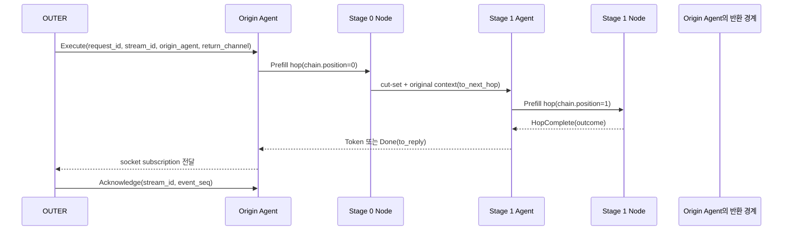
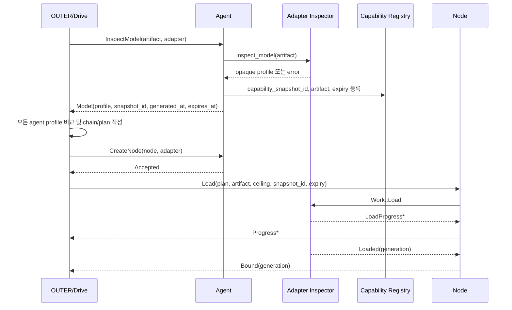
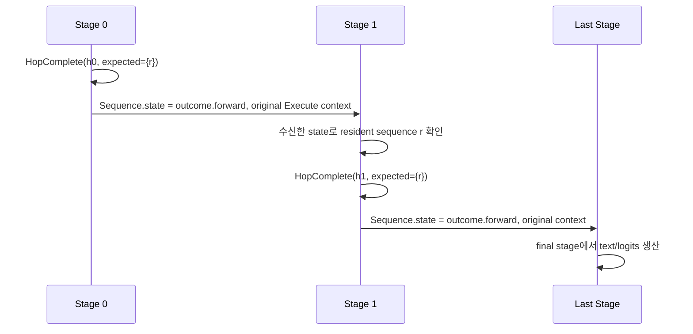
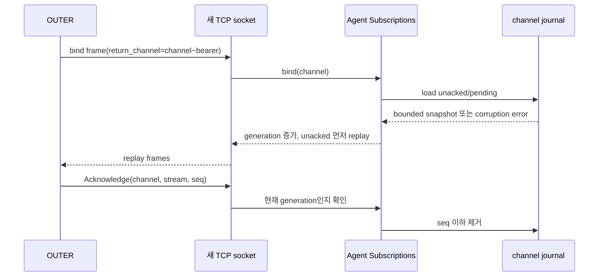
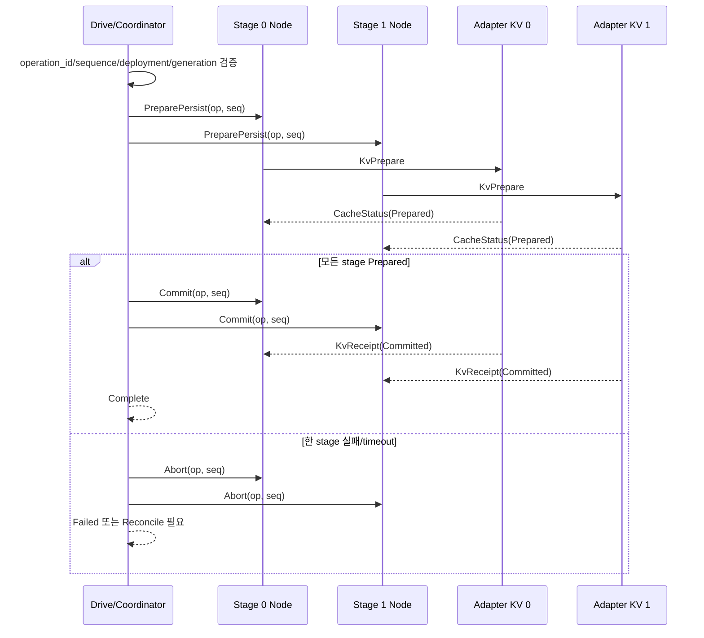
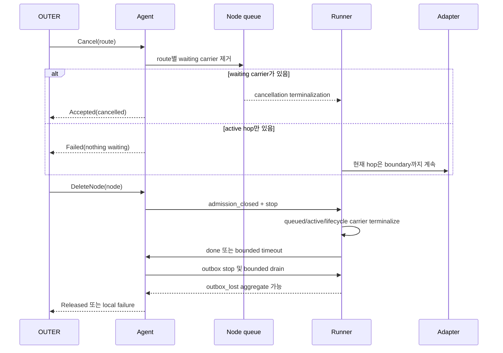
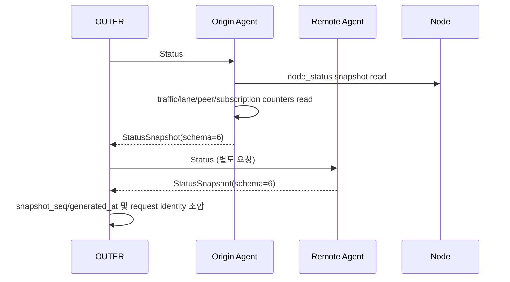
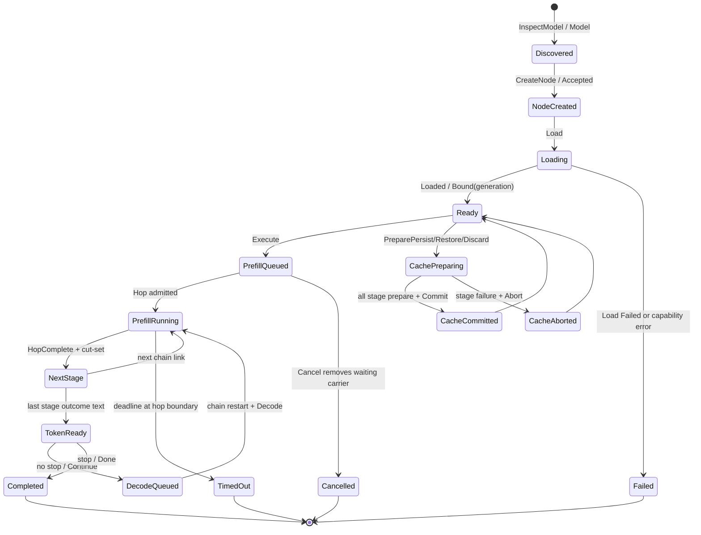

# P4 추상 프로토콜

이 문서는 현재 P4 구현의 최종 계약이다. 과거 감사 순서나 수정 경과는
기록하지 않으며, 코드·테스트로 확인된 동작과 아직 정책이 필요한 경계를
구분한다.

## 1. 범위와 책임

P4는 OUTER가 전달한 요청을 여러 agent/node와 adapter 사이로 운반하고,
결과를 원래 OUTER의 논리 채널로 되돌리는 추상 전송·스케줄링 계층이다.

| 책임 | P4의 계약 | 소유자 |
| --- | --- | --- |
| 라우팅 | envelope의 주소·chain·request identity를 보존하고 다음 hop으로 전달 | P4 |
| 실행 | bounded queue, hop admission, hop 결과와 terminal 상태 전달 | P4 + adapter seam |
| 생성 옵션 | 요청 본문을 byte-preserving opaque payload로 운반 | OUTER/구상 adapter |
| sampling/decoding | 의미 해석·기본값 결정·스위치 변환을 하지 않음 | OUTER/구상 adapter |
| 모델 분산계획 | GGUF와 adapter capability를 조회해 배치계획을 만드는 일 | OUTER/drive + agent discovery |
| KV cache | operation identity와 stage barrier를 운반하고 receipt를 조정 | P4 cache coordinator + adapter |
| 장치·라마 의미 | backend report를 opaque text/capability로 전달 | 구상 adapter |

`apps/p4/layers/adapters/llamacpp/upstream`은 교체 가능한 외부 경계다.
추상 계층은 llama.cpp private API에 의존하지 않으며, 다른 adapter도 같은
P4 seam을 구현할 수 있어야 한다.

## 2. 메시지와 식별자

wire frame은 `apps/p4/layers/protocol/src/envelope/`와
`apps/p4/layers/protocol/src/frame/`이 정의한다. frame version 7의 핵심
필드는 다음과 같다.

| 필드 | 의미 | 불변성 |
| --- | --- | --- |
| `target` | 다음 소비자의 주소 | hop마다 갱신 가능 |
| `recipient` | 해당 주소 안의 agent/node 이름 | 수신 경계에서 검증 |
| `route` | legacy shard/order key | transport 보조값, 요청 identity가 아님 |
| `request_id` | 하나의 inference 요청 identity | 요청 전 생애 동안 불변 |
| `stream_id` | 하나의 streaming response 집합 | response 전 생애 동안 불변 |
| `origin_agent` | OUTER 요청을 최초 수락한 agent | reply anchor |
| `return_channel` | OUTER 논리 반환 채널 | socket 주소로 추론하지 않음 |
| `event_seq` | stream 내 response event 순번 | non-zero는 단조 증가 |
| `hop_id` | 한 node에서 실행한 한 hop identity | completion이 echo하며 중복 거부 |
| `chain` | 순서가 있는 stage/node 목록 | continuation에서 보존 |
| `operation_id` | cache/lifecycle 작업 identity | 해당 작업 request와 일치 |

`origin_agent`가 정상적인 반환 anchor다. `reply_to`는 legacy 또는 직접
전달 fallback으로만 사용한다. 마지막 node가 생산한 token/terminal frame은
`request_id`, `stream_id`, `return_channel`, `event_seq`를 유지해 origin
agent와 OUTER 채널로 돌아간다.

## 3. OUTER 반환 채널

주소는 listener를 식별할 뿐 개별 OUTER 연결을 식별하지 않는다. production
ingress의 `return_channel`은 다음 형태여야 한다.

```text
<logical-channel>~<at-least-64-hex-digit-bearer>
```

이 값은 논리 채널을 accepted socket에 bind하는 possession/shape gate다.
강한 사용자·프로세스 인증, 발급자 검증, revocation, audience 검증을
제공하지 않는다.

`Subscriptions`는 process-wide registry이며 다음 정책을 적용한다.

- 논리 slot 최대 1024개
- 채널별 pending 최대 1024 frame
- 채널별 unacked 최대 1024 frame
- 재연결 시 같은 channel을 bind하면 unacked 후 pending 순서로 replay
- socket generation이 다른 stale ACK는 거부
- pending overflow는 oldest drop이며 protocol-level gap frame은 없음
- 알 수 없는 channel은 registry가 새로 claim하지 않고 일반 fallback으로 보냄

capability 판정은 마지막 `~`만 구분자로 사용하는 `rsplit` 규칙이다. 왼쪽
logical channel은 비어 있으면 안 되고, 오른쪽 bearer는 최소 32 byte를
표현하는 64자 이상이어야 하며 길이가 짝수이고 모든 문자가 ASCII hex여야
한다. capability registry는 최대 4096개이며 insert 때 만료 항목을 먼저
제거하고, 가득 찬 상태에서 새 id를 넣으면 `expires_at`이 가장 이른 항목
하나를 eviction한다.

`P4_AGENT_STATE_ROOT`가 설정된 entrypoint는 channel journal을 선택적으로
사용한다. non-zero `event_seq` frame은 socket write 전에 journal에 기록하고,
ACK가 확인한 `(return_channel, stream_id, event_seq)`를 제거한다. journal
읽기/쓰기/초기 snapshot 저장에 실패하거나 corrupt이면 channel은 generation
`0`으로 fail-closed하며 replay를 반환하지 않는다. 기본 `Subscriptions`는
process-local이다.

다음은 의도적으로 보장하지 않는다.

- fsync와 parent-directory sync를 포함한 전원장애 내구성
- cross-process channel ownership
- journal compaction 및 디스크 quota
- socket write 이후 duplicate 방지
- exactly-once delivery
- socket/OUTER까지 도달한 durable delivery receipt

## 4. 요청 생명주기와 terminal 규칙

논리 상태는 다음과 같다.

```text
accepted -> queued -> running -> yielded -> queued
                         |          |\
                         |          +-> completed
                         |             -> failed
                         |             -> cancelled
                         +--------------> expired
```

각 실행 event는 `request_id`, stage, `hop_id`, timestamp와 monotonic
`event_seq`를 보존해야 한다. old generation, stale hop, duplicate completion,
불완전한 completion set은 node에서 거부한다.

terminalization 정책:

- queued carrier는 거부/취소 시 terminal error를 생성한다.
- active carrier는 adapter의 다음 hop 경계에서 종료한다.
- lifecycle/cache carrier도 node shutdown 중 terminalized된다.
- adapter가 deadline 후에도 응답하지 않으면 `timed_out` 상태를 보고할 수
  있지만, 강제 native cancellation이나 즉시 resource release는 보장하지
  않는다.
- outbox 또는 downstream이 닫히면 외부 전달은 보장되지 않으며,
  `outbox_lost`/`event_loss` aggregate에 반영될 수 있다.

## 5. 파이프라인 병렬과 연속 요청

각 node는 한 번에 하나의 adapter hop을 실행하지만, 하나의 hop window 안에서
adapter가 선언한 ceiling까지 sequence를 admission한다. 다른 request는
앞뒤 stage의 bounded queue에 들어가며, stage가 비어 있을 때 event-driven
feeding으로 다음 작업을 넣는다.

보장되는 것:

1. 한 `hop_id`는 한 node에서 최대 한 번 실행된다.
2. adapter admission ceiling과 node queue depth를 초과하지 않는다.
3. 서로 다른 request는 서로 다른 stage를 동시에 점유할 수 있다.
4. main dispatcher는 평상시 `Control > Response > Decode > Prefill` 순으로
   poll하되 16번째 take마다 네 lane을 공정하게 경쟁시킨다. node window는
   `Decode`를 무조건 우선하지 않는다. live decode가 ceiling만큼 차 있으면
   Decode를 고르고, 아직 여유가 있으면 Prefill을 먼저 골라 admission을
   채운다. 따라서 Decode 우선은 bounded preference이지 strict priority나
   GPU utilization 보장이 아니다.
5. downstream 포화는 bounded backpressure 또는 명시적 refusal이다.
6. stage의 queued/running/idle/blocked 상태는 typed status에서 구분되는
   범위까지만 보고한다.

P4 wire는 global credit, min/max batch width, continuous batching ownership,
prefill/decode service-level guarantee, GPU utilization을 정의하지 않는다.
따라서 mock overlap 테스트는 scheduling 가능성을 증명하지만 실제 GPU가
항상 feed된다는 증거는 아니다.

## 6. 큐, worker, CPS

worker와 queue의 책임은 다음과 같다.

기본 agent budget은 `connections=1024`, `in_flight=256`, 공통 lane
`depth=4096`이다. 이 세 값은 서로 독립적이다. lane 기본값은 Control 1024,
Prefill 4096, Decode 8192, Response 4096이며, 0인 budget은 시작 시
검증 오류로 거부한다. peer outbound pump마다 별도로 4096 frame queue가
있고, subscription socket은 accepted connection semaphore와 channel별
1024-depth queue의 제한을 동시에 받는다.

- 중앙 route worker는 route hash로 동일 route를 같은 worker에 보내 순서를
  보존한다.
- worker inbox가 차면 `try_send` refusal을 반환하며 다른 route를 무기한
  기다리지 않는다.
- main queue, lane, peer queue, node ingress, adapter event, outbox는
  bounded capacity를 가진다.
- adapter blocking worker가 event를 `blocking_send`하고, node event loop는
  adapter completion을 기다리며 reader를 막지 않는다.
- process-wide adapter admission permit 대기는 async로 수행되어 node가
  다른 arrival/completion을 계속 받을 수 있다.
- outbox producer는 bounded send에서 backpressure를 받을 수 있지만,
  무제한 retry/polling/sleep loop로 전환하지 않는다.
- shutdown은 runner, outbox, terminal carrier에 각각 bounded wait를 적용한다.

queue가 포화되면 정책은 `queue_full` refusal과 retry guidance다. 현재 P4는
일반 inference queue를 disk spill하지 않는다. 영속 FIFO spill을 추가하려면
byte quota, ordering, crash recovery, refusal/expiry 규칙을 별도 wire 정책으로
정해야 한다.

## 7. 모니터링

legacy `Status` 문자열은 호환성을 위해 유지한다. 신규 status snapshot은
service message schema 6이며 schema 1~5 reader compatibility를 유지한다.

현재 typed snapshot이 제공하는 범위:

- snapshot sequence와 생성 시각
- agent traffic/lane/peer/continuation aggregate
- node route/backend report
- queued request identity
- active `request_id`, `stream_id`, `hop_id`, phase, timeout marker
- subscription pending/unacked/dropped/ACK-rejected aggregate
- node `outbox_lost` aggregate

다음은 제공하지 않는다.

- per-event ACK/gap trace와 socket별 delivery receipt
- intermediate peer queue depth/capacity/spill
- per-request enqueue/start/progress timestamp
- device activity, VRAM/KV residency, allocator trend
- durable history 또는 exactly-once 증명

`outbox_lost`, `event_loss`, `ack_rejected`는 원인별·요청별 trace가 아니라
process-local aggregate다. monitoring consumer는 값이 0인 것과 “보고되지 않음”을
구분해야 한다.

## 8. 생성 요청과 adapter portability

OUTER는 prompt, max tokens, sampling/decoding parameters, grammar, structured
output, stop/template, backend launch switch 등 구상 backend 지식을 가지고
serialized request/options를 만든다. P4는 다음만 책임진다.

1. opaque generation content를 byte-preserving으로 전달한다.
2. 모든 hop과 decode lap에서 content를 보존한다.
3. frame/body size와 transport validity limit을 검사한다.
4. 필드를 해석해 삭제하거나 다른 기본값으로 치환하지 않는다.
5. adapter가 이해하지 못하면 adapter-owned error를 반환한다.

adapter는 opaque content를 자신의 API/프로세스 실행 인자로 변환한다.
따라서 llama.cpp가 아닌 adapter도 동일한 P4 contract를 구현할 수 있으며,
P4는 특정 backend의 sampling·decoding·speculative 기능 의미를 정의하지
않는다. 단, 성공한 prefill 뒤에는 요청된 generation에 대해 하나 이상의
token-bearing event를 전달할 수 있어야 한다. 한 event에 여러 token을 담거나
여러 Decode lap으로 나누는 것은 adapter 선택이다.

### 8.1 이번 비-MTP/speculative 범위에서 닫힌 결정

과거 초안의 §8-3, §8-6, §8-10은 현재 코드와 회귀 테스트로 다음처럼
고정했다. 이 결정은 P4의 bounded/mock/local 계약과 검증된 staged 범위에
대한 것이며, broader production 보장을 의미하지 않는다.

| 결정 | 현재 계약 | 근거 |
| --- | --- | --- |
| identity 소유 | `request_id`는 요청 전체에서 불변이고 `route`는 transport key다. `SequenceId`는 payload 경계에서 `request_id`에서 파생하며, `hop_id`는 node의 한 실행 pass, `stream_id`/`return_channel`은 반환 스트림 identity다. legacy에서만 빈 `request_id`를 `route`로 대체한다. | `apps/p4/layers/service/src/payload/mod.rs`, `apps/p4/layers/service/src/payload/tests.rs`, `apps/p4/layers/protocol/src/envelope/mod.rs` |
| window/admission | `Load.ceiling`이 node adapter admission의 상한이다. `compose`는 한 번에 한 lane만 골라 그 상한 이하로 window를 만들며, P4 wire는 global credit·continuous batching·GPU feed SLA를 소유하지 않는다. | `apps/p4/layers/agent/src/node/window/mod.rs`, `apps/p4/layers/agent/src/node/runner/`, `apps/p4/layers/agent/src/node/window/tests.rs` |
| KV transaction | multi-stage cache work는 `operation_id`, sequence, deployment generation, stage set을 고정하고 prepare → commit 또는 abort barrier를 통과해야 한다. 잘못된 identity/phase/partial commit은 실패 또는 보상 abort다. | `apps/p4/layers/service/src/cache.rs`, `apps/p4/layers/service/tests/cache_barrier.rs` |
| MTP/speculative | 이번 범위의 지원 capability가 아니다. parser/ownership probe를 실행 지원으로 승격하지 않으며, 요청은 `CAPABILITY_UNAVAILABLE`로 거부한다. | `buildplan.md` Gate 5, `apps/p4/layers/adapters/llamacpp/staged/server/src/server/` |

따라서 이 네 결정은 non-MTP staged local frame을 동결하는 데 더 이상
열린 의사결정이 아니다. 다만 native 장기 실행, 전원장애, durable delivery,
강제 cancellation 같은 production gate는 §11에 별도로 남긴다.

## 9. 모델 discovery와 분산 로딩

OUTER가 모델 아키텍처를 직접 알지 못하면 분산 로딩 계획 전에 agent에
discovery를 요청한다. agent/adapter는 선택된 GGUF 파일 집합에서 얻을 수 있는
다음 정보를 opaque profile로 반환한다.

- artifact identity와 파일 목록/크기
- model architecture 및 tensor/quantization profile
- context/embedding/layer 관련 capability
- 해당 agent가 실제로 제공할 수 있는 adapter/backend 종류
- placement에 필요한 VRAM/RAM 요구량과 분산 가능 범위
- profile snapshot identity와 expiry

drive/OUTER는 모든 선택 agent의 artifact와 profile identity/expiry를 대조한
뒤 deployment chain과 stage placement를 결정한다. agent는 Load 시 전달받은
snapshot이 자신의 artifact와 일치하고 만료되지 않았는지 재검증한다. discovery
profile은 hardware fingerprint나 durable cross-process registry가 아니다.

## 10. KV cache와 cache transaction

`SequenceId`는 immutable `request_id`에서 파생하며 legacy frame에 한해
`route` fallback을 허용한다. cache work는 다음 identity를 함께 가진다.

- `operation_id` = 해당 cache 작업의 request identity
- sequence identity
- chain generation
- stage/node identity
- deployment identity

지원 동작은 persist, restore, fork, discard다. multi-stage save/restore는
prepare → commit/abort barrier를 사용하고, 각 stage receipt가 operation,
sequence, generation, stage와 일치해야 진행한다. stale/duplicate/phase가
맞지 않는 receipt는 거부한다.

P4 coordinator의 multi-stage barrier와 journal identity/recovery는 구현·테스트
범위에서 닫혀 있다. 다음은 그 위에 필요한 broader production 계약이며 이번
변경에서 닫지 않는다.

- adapter KV bytes와 manifest의 공통 형식
- receipt 파일과 coordinator journal 사이 cross-file atomicity
- `Committing` 중 crash recovery의 native parity
- Windows/Linux 전원장애 복구와 장기 retention

## 11. 구현·검증 기준

주요 구현 위치:

| 영역 | 코드 |
| --- | --- |
| envelope/frame wire | `apps/p4/layers/protocol/src/envelope/`, `src/frame/` |
| agent ingress/replay | `apps/p4/layers/agent/src/transport/inbox/` |
| worker/queue | `apps/p4/layers/agent/src/agent/`, `src/queue/`, `src/node/` |
| node lifecycle/outbox | `apps/p4/layers/agent/src/node/runner/` |
| status/cache wire | `apps/p4/layers/service/src/message/`, `src/status/`, `src/cache*` |
| discovery/capability | `apps/p4/layers/service/src/capability.rs`, `src/payload/` |
| agent entrypoint | `apps/p4/entrypoints/agent/src/main.rs` |

현재 직접 실행된 회귀 검증:

- `cargo test -p p4-agent-core --lib`: 100 passed
- `cargo test -p p4-service --lib`: 62 passed (plus integration suites)
- journal replay/corruption/slot bound, outbox shutdown, node lifecycle,
  status schema compatibility, cache barrier 및 message round-trip 테스트 포함

이 결과는 bounded mock/local correctness와 문서화된 staged 실모델 범위의
증거다. 다음 broader production acceptance를 통과하기 전에는 production
ready로 판정하지 않는다.

### Broader production acceptance gates (intentionally open)

1. native adapter와 실제 GPU에서 장기 pipeline CPS, fairness, p95/p99
   latency, resident memory/allocator trend
2. GPU feed-at-capacity와 prefill/decode 지속 overlap
3. process crash/restart와 power-loss journal/KV recovery
4. reconnect gap/duplicate 및 durable OUTER delivery policy
5. native cancellation, resource release, cross-process capability ownership

문서가 코드보다 강한 보장을 주장하지 않도록, 위 항목은 검증 전까지 OPEN으로
유지한다.

## 12. P4 frame wire 규격

추상 P4 TCP frame의 구현은
`apps/p4/layers/protocol/src/frame/mod.rs`에 있다. relay는 envelope만
해석하고 body는 목적지까지 raw bytes로 보존할 수 있다.

### 12.1 고정 header

모든 정수는 little-endian이다.

| offset | 크기 | 의미 |
| ---: | ---: | --- |
| 0 | 4 | magic `P4B1` |
| 4 | 1 | frame version `7` |
| 5 | 3 | reserved, 현재 0 |
| 8 | 4 | envelope byte length (`u32`) |
| 12 | 4 | body byte length (`u32`) |
| 16 | 가변 | envelope bytes, 이후 body bytes |

header 전체는 16 byte다. envelope 최대는 256 KiB, body 최대는 1 MiB다.
`frame_len()`은 header가 선언한 전체 길이를 계산하지만 body를 decode하지
않는다. `decode()`는 실제 입력 길이가 header 계산값과 정확히 같아야 성공한다.
magic, version, 길이, envelope decode 중 하나라도 실패하면 frame 전체를
거부한다. `reseal()`은 envelope을 바꾸고 body bytes는 그대로 유지한다.

### 12.2 envelope wire 필드와 검증

envelope wire 순서는 다음과 같다.

```text
target Address
recipient tag [, node id]
lane tag
route text
request_id text
stream_id text
origin_agent present flag [, Address]
return_channel present flag [, text]
event_seq u64
deadline_unix_ms u64
reply_to present flag [, Address]
chain present flag [, Chain]
```

text는 `u32 byte_length + UTF-8 bytes`이며 envelope primitive의 text 최대는
256 KiB다. optional present flag는 `0=absent`, `1=present`만 허용한다. 다른
flag, truncated field, invalid UTF-8, trailing bytes는 `ProtocolError`다.

- `request_id`와 `stream_id`는 wire encode/decode에서 비어 있을 수 없다.
- chain이 present이면 `origin_agent`와 `return_channel`도 present여야 한다.
- present return channel은 빈 문자열일 수 없다.
- `ingress_generation`은 envelope 구조체에 있지만 wire에 기록하지 않는다.
  decode 결과는 0이며 accepted-socket reader가 local metadata로 주입한다.
- `return_key()`는 wire field가 아니라
  `len(request_id):request_id + len(stream_id):stream_id +
  len(return_channel):return_channel`로 만드는 process-local key다.

주소는 현재 `tcp://host:port`만 지원한다. scheme은 `tcp`, host는 비어 있지
않아야 하며 port는 1..=65535의 숫자여야 한다. IPv6 host는 마지막 colon
기준으로 port를 나눈다.

### 12.3 recipient, lane, chain

`recipient`는 다음 둘 중 하나다.

| tag/개념 | 의미 |
| --- | --- |
| `Agent` | node registry, inspect, status, cancel, ACK 등 agent 소유 작업 |
| `Node(node_id)` | load/unload, execute/continue, cache 등 materialized node 작업 |

`QueueClass`는 envelope에 실려 body를 읽지 않고 lane을 선택한다.

| lane | 의미 | 기본 main depth |
| --- | --- | ---: |
| `Control` | create/delete/inspect/status/cancel/ACK | 1024 |
| `Prefill` | 새 prompt의 첫 hop | 4096 |
| `Decode` | KV를 보유한 request의 다음 lap | 8192 |
| `Response` | token/progress/terminal/cache reply | 4096 |

chain의 각 `Link`는 `address`, `node`, `binding`, `generation`을 가진다.
wire layout은 `chain present flag`, `count u32`, `position u32` 다음에
각 link를 `address text`, `node text`, `binding text`, `generation u64`
순서로 기록한다. count는 최대 256이며 빈 chain은 생성할 수 없고 position은
마지막 link를 넘어갈 수 없다. chain position이 first이면 `is_first()`,
마지막이면 `is_last()`다.

- `to_next_hop()`은 position을 하나 증가시키고 다음 link의 address/node로
  target/recipient를 바꾼다. lane은 유지한다.
- `to_next_lap()`은 chain position을 0으로 되돌리고 lane을 `Decode`로
  바꾼다.
- `to_reply()`는 `origin_agent`를 우선하고 없을 때만 `reply_to`를 사용한다.
  response lane으로 바꾸며 `reply_to`는 제거한다.
- `relay_home()`은 실패한 target과 다르고 현재 agent 자신도 아닌 chain 첫
  link를 한 번의 fallback target으로 반환한다.

## 13. service body 규격

service body 구현은 `apps/p4/layers/service/src/message/`에 있다. body tag는
enum 선언 순서가 아니라 고정 상수이므로 variant를 재배열해도 기존 peer의
해석이 바뀌지 않는다. 모든 text는 `u32 little-endian length + UTF-8`이고
각 text 최대는 256 KiB다. body 끝에 남는 trailing bytes, unknown tag,
truncation, invalid UTF-8은 `Malformed`다.

### 13.1 agent 명령 (`ToAgent`)

| tag | variant | body 필드 | 처리 의미 |
| ---: | --- | --- | --- |
| 1 | `CreateNode` | `node: text`, `adapter: text` | registry에 node를 만들고 adapter factory를 연결 |
| 2 | `DeleteNode` | `node: text` | node admission을 닫고 bounded shutdown 후 제거 |
| 3 | `Inspect` | 없음 | agent가 가진 machine/backend snapshot 반환 |
| 4 | `Cancel` | `route: text` | 모든 node의 대기 carrier에서 route를 취소 |
| 5 | `Status` | 없음 | typed status snapshot 반환 |
| 6 | `InspectModel` | `artifact: text`, `adapter: text` | 선택 adapter가 artifact/GGUF profile을 검사 |
| 7 | `Acknowledge` | `return_channel: text`, `stream_id: text`, `event_seq: u64` | 해당 stream의 event_seq 이하 replay journal ACK |

`CreateNode`는 adapter 이름이 registry에 없으면 node를 만들지 않고 실패한다.
`InspectModel`은 loaded deployment를 변경하지 않는 discovery operation이다.
`Acknowledge`는 body channel과 envelope return channel이 같은지 먼저 검사하며,
다르면 ACK를 적용하지 않고 `ack_rejected` aggregate만 증가시킨다.

### 13.2 node 명령 (`ToNode`)

| tag | variant | body 필드 | queue/수명 |
| ---: | --- | --- | --- |
| 16 | `Load` | `plan`, `artifact`, `ceiling: u32`, `capability_snapshot_id`, `capability_expires_at: u64` | lifecycle, 단독 실행 |
| 17 | `Unload` | 없음 | lifecycle, 단독 실행 |
| 18 | `Execute` | `prompt`, `max_tokens: u32`, `options` | prefill, sequence 시작 |
| 19 | `Persist` | `sequence` | cache lifecycle, 단독 실행 |
| 20 | `Restore` | `sequence` | cache lifecycle, 단독 실행 |
| 21 | `Fork` | `sequence`, `into` | cache lifecycle, 원본 보존 후 새 identity 생성 |
| 22 | `Discard` | `sequence` | cache lifecycle, durable copy 삭제 |
| 23 | `PreparePersist` | `sequence` | transaction prepare |
| 24 | `PrepareRestore` | `sequence` | transaction prepare |
| 25 | `PrepareDiscard` | `sequence` | transaction prepare |
| 26 | `Commit` | `sequence` | prepare mutation 적용 |
| 27 | `Abort` | `sequence` | prepare mutation 취소 |
| 28 | `Continue` | `remaining: u32`, `emitted: u32`, `options`, `state: bytes` | decode lap의 다음 단계 |
| 29 | `Reconcile` | `sequence` | mutation 없이 adapter receipt 조회 |

`Load`의 plan과 `Execute/Continue`의 options는 P4가 해석하지 않는 opaque
text다. `ceiling`은 load가 선언한 adapter admission ceiling이며 P4가
backend 정보로 재계산하지 않는다. 현재 node runner는 `ceiling.max(1)`을
사용하므로 wire의 `ceiling=0`은 adapter에 1로 전달된다. 0을 명시적으로
거부하는 정책은 아직 없다. `capability_snapshot_id`가 비어 있거나
expiry가 0/만료이면 production payload 경계에서 adapter 호출 전에 실패한다.

`Execute`는 새 sequence의 prompt와 전체 token bound를 가진다. `Continue`는
prompt를 반복하지 않고 `remaining`, `emitted`, `options`, `state`만 가진다.
`remaining`은 원 request의 bound이며 lap마다 보존된다. `emitted`는 P4가 지금까지
스트리밍한 token 수로, bound를 강제하는 쪽이 자기 출력을 세는 값이다. 세션이
얼마나 진행되었는지는 backend의 사실이므로 `state` 안에 있고 P4는 읽지 않는다.

### 13.3 reply body (`Reply`)

| tag | variant | 필드 | 의미 |
| ---: | --- | --- | --- |
| 32 | `Accepted` | `detail` | 명령/작업이 admission됨 |
| 33 | `Progress` | `stage: u32`, `percent: u32` | load stage 진행률 |
| 34 | `Bound` | `generation: u64` | deployment가 materialized된 generation |
| 35 | `Released` | 없음 | unload/delete 완료 |
| 36 | `Token` | `index: u32`, `text` | 생성 token-bearing event |
| 37 | `Done` | `reason`, `generated: u32` | 정상/stop terminal |
| 38 | `Failed` | `detail` | generic 실패, cache identity 없음 |
| 39 | `Machine` | `snapshot` | legacy machine/discovery text |
| 40 | `Status` | `snapshot` | legacy human-readable status text |
| 41 | `Cached` | deployment, stage_id, generation, operation_id, sequence, bytes, detail | cache mutation 완료 |
| 42 | `Model` | artifact, adapter, profile, capability_snapshot_id, generated_at, expires_at | model discovery 결과 |
| 43 | `StatusSnapshot` | typed snapshot | schema 1..6 monitoring |
| 44 | `CacheFailed` | deployment, stage_id, generation, operation_id, sequence, detail | identity-bearing cache 실패 |
| 45 | `CacheStatus` | deployment, stage_id, generation, operation_id, sequence, state, bytes, detail | receipt reconciliation 결과 |

`Token`의 `text`가 비어 있을 수 있는지는 adapter 결과가 결정하며, terminal
여부는 `Done` 또는 adapter `Outcome.stop`으로 구분한다. 현재 outcome 변환은
`stop=Some`인 outcome을 먼저 terminal로 판정하므로 text와 stop이 동시에
있어도 `Token`을 별도로 만들지 않고 `Done`만 만든다. 이는 최종 token과
terminal을 함께 보장하는 규칙이 아니다. `CacheFailed`는
current chain link와 cache work를 모두 식별할 수 있을 때만 생성된다. 그
정보가 없으면 generic `Failed`로 내려간다.

## 14. agent duties와 body 소비 순서

`Standard` duties의 소비 순서는 다음과 같다.

1. envelope target/recipient를 core worker가 판단한다. body를 읽지 않고
   relay할 수 있다.
2. target이 현재 agent이고 recipient가 `Agent`이면 body를
   `decode_to_agent()`한다.
3. decode 실패는 `Reply::Failed`의 `unreadable agent message` detail로
   반환한다.
4. agent 명령은 다음처럼 실행된다.

| 명령 | 성공 | 실패/부작용 |
| --- | --- | --- |
| CreateNode | `Accepted`, 비동기 node 생성 | unknown adapter면 `Failed` |
| DeleteNode | shutdown 후 `Released` | 없는 node면 `Failed` |
| Inspect | `Machine` | snapshot은 adapter/backend text를 opaque로 유지 |
| InspectModel | `Model` + capability registry insert | adapter inspection 오류면 `Failed` |
| Cancel | 대기 route가 있으면 `Accepted` | 찾지 못하면 `Failed` |
| Status | `StatusSnapshot` | typed schema layout 오류는 decode에서 거부 |
| Acknowledge | journal event 제거 | channel mismatch/stale generation은 aggregate rejection |

5. target이 node이면 `decode_to_node()` 후 lifecycle 또는 sequence 경로로
   분기한다. 지원하지 않는 body는 node admission 전에 거부한다.

응답 frame은 `Envelope::to_reply()`로 origin agent를 목적지로 삼는다. 아무
reply handler도 없고 return channel도 bind되지 않은 response는 조용히 성공한
것으로 간주하지 않으며 fallback/duties 경계를 거쳐 `unrouted` 또는 loss
counter에 반영될 수 있다.

## 15. typed status 상세 layout

현재 `MIN_SUPPORTED_SCHEMA=1`, `MAX_SUPPORTED_SCHEMA=6`이다. schema를 먼저
검사하므로 0 또는 6보다 큰 schema는 나머지 byte를 읽기 전에 거부한다.

### 15.1 공통 필드

`StatusSnapshot`은 다음을 가진다.

```text
schema: u16
snapshot_seq: u64
generated_at_unix_ms: u64
address: text
traffic: forwarded, consumed, to_nodes, unrouted, refused, emergency_lost
lanes: control, prefill, decode, response
peers: usize
continuations: usize
subscription_pending: usize
subscription_unacked: usize
subscription_dropped: usize
[schema >= 2] subscription_ack_rejected: usize
nodes: NodeSnapshot[]
```

wire에서는 schema가 `u32`로 기록되고, 위 aggregate count들은 `u64`로
기록된다. 각 node는 항상 `node`, `depth`, `running`, `backend` 순으로
기록되고, schema 6부터 그 다음에 node-local `outbox_lost` aggregate가
삽입된다. 그 뒤 `waiting[]` 및 schema 3 이상의 waiting request, schema 4
이상의 active hop이 이어진다. `outbox_lost`는 top-level aggregate가 아니다.

### 15.2 schema 확장

| schema | 추가/기본값 |
| ---: | --- |
| 1 | 공통 snapshot, waiting route 문자열 |
| 2 | `subscription_ack_rejected` 추가 |
| 3 | waiting request의 route/request_id/stream_id/lane/deadline 추가 |
| 4 | active hop marker, id, phase, request 배열 추가 |
| 5 | active hop `timed_out` marker 추가 |
| 6 | 각 node의 `backend` 뒤에 `outbox_lost` 추가 |

구 schema를 decode할 때 없는 값은 ACK count 0, outbox loss 0, waiting request
빈 배열, active hop `None`, timeout false로 복원한다. lane tag는
`0=Control, 1=Prefill, 2=Decode, 3=Response`, phase tag는
`0=Prefill, 1=Decode`다. active-hop marker와 timeout marker는 각각 0/1만
허용한다.

이 snapshot은 bounded best-effort projection이다. traffic, lane, subscription,
node 필드는 각각 별도로 읽힌 뒤 하나의 `snapshot_seq`로 포장되므로, 단일
agent 내부에서도 모든 필드가 하나의 원자적 시점에서 읽혔음을 의미하지
않는다. `snapshot_seq`는 순서를 비교하기 위한 값이지 모든 request event를
저장한 log offset이 아니다.

## 16. adapter 추상 경계

`apps/p4/layers/adapters/adapter/src/lib.rs`의 trait은 다음만 노출한다.

```text
inspect_model(artifact) -> Result<opaque profile, error>
distribution() -> Distribution
start(work, event_sink) -> 즉시 반환
report() -> cheap opaque backend text
```

`start()`는 결과를 반환하거나 호출자를 기다리게 하지 않는다. adapter는
`EventSink`에 event를 비동기로 올리고 node runner가 다음 작업을 결정한다.
`report()`는 status 요청에서 호출되므로 blocking 작업을 해서는 안 된다.

### 16.1a `Distribution`

adapter는 `Internal` 또는 `Staged` 중 하나의 model distribution을 보고한다.

| 값 | 의미 | chain 사용 |
| --- | --- | --- |
| `Internal` | backend가 tensor/pipeline parallelism과 device 경계를 내부에서 소유하고 하나의 entry point를 제공 | 하나의 chain link만 가능 |
| `Staged` | P4 chain이 layer range 경계를 소유하며 node마다 model 일부를 materialize | 여러 link의 stage 가능 |

`can_be_a_stage()`는 `Staged`에서만 true다. P4는 `Distribution`을 보고하고
placement를 결정하는 OUTER/drive가 이를 사용한다. node가 `Internal` adapter의
내부 shard를 별도 chain node처럼 주소화해서는 안 된다.

### 16.1b `Work`

`Work`는 `Load`, `Unload`, `Hop`, `Cache` 네 종류다.

`Load`:

```text
deployment: String
plan: String                  # opaque placement/backend plan
artifact: String
capability_snapshot_id: String
capability_expires_at: u64
```

`Hop`:

```text
id: u64                       # one execution pass
deployment: String
phase: Prefill | Decode
sequences: Sequence[]
```

각 `Sequence`:

```text
sequence: SequenceId
prompt: Option<String>
state: Option<bytes>          # opaque adapter bytes; P4 never reads them
remaining: u32
options: String               # opaque generation options
```

`state`는 adapter가 쓰고 adapter만 읽는 opaque byte 값이며, 다음 hop에
그대로 되돌려받는다. 과거에는 position, 샘플된 token, tensor cut-set과 그
배치가 각각 별도 필드였지만, 지금은 모두 이 하나의 `state` 안에 산다. P4는
그 내용을 해석하지 않고 adapter가 쓴 그대로 다음 `Sequence.state`로
전달한다.

`prompt`는 first stage 또는 internal backend에만 존재한다. 후속 staged
stage는 prompt를 다시 해석하지 않고 자신의 resident `state`를 사용한다.
`remaining=0`은 더 이상 sequence를 예약하지 않는 terminal 경계다.

### 16.2 adapter `Event`

| event | 필드 | node 의미 |
| --- | --- | --- |
| `LoadProgress` | deployment, stage, percent, detail | stage별 load 진행 |
| `Loaded` | deployment, generation, allocations[] | 실행 가능한 materialization |
| `Unloaded` | deployment | deployment release 완료 |
| `HopComplete` | hop_id, deployment, expected[], outcomes[] | 현재 hop 종료 및 queue 재평가 |
| `Cached` | deployment, stage_id, generation, operation_id, sequence, bytes, detail | cache mutation 완료 |
| `CacheStatus` | 위 identity + state, bytes, detail | receipt query 결과 |
| `Failed` | deployment, sequence?, hop_id?, detail | 해당 work terminal 실패 |

`Allocation`은 `category: String`, `bytes: u64`다. allocation category의
의미는 adapter 소유다. `HopComplete.expected`는 adapter가 실제로 받은
sequence set이며 node가 in-flight set과 정확히 비교한다.

각 `Outcome`:

```text
sequence: SequenceId
forward: Option<bytes>        # opaque adapter bytes, handed back as the next Sequence::state
text: String
stop: Option<String>
```

`stop`이 Some일 때만 sequence가 terminal이다. middle staged node는 text가
비어 있을 수 있다. 마지막 node 또는 internal backend만 text/logits 결과를
생산한다. `forward`는 다음 stage로 넘기는 opaque backend state이며, 다음
hop에서 그대로 `Sequence.state`가 된다.

## 17. cache/KV 추상 규격

### 17.1 P4 cache work

`Cache`는 한 sequence에 대한 단독 lifecycle work다.

```text
deployment: DeploymentId
stage_id: String
generation: u64
operation_id: String
sequence: SequenceId
action: Reconcile | PreparePersist | Persist | PrepareRestore | Restore |
        PrepareDiscard | Fork(into) | Discard | Commit | Abort
```

`subject()`는 `Fork`이면 `into`, 그 외에는 원래 sequence를 반환한다.
`operation_id`는 multi-stage transaction 전체를 묶고, stage generation은
rebound deployment에 낡은 KV를 복원하지 못하게 한다.

receipt state는 `Absent`, `Prepared`, `Committed`, `Aborted`, `Inconsistent`다.
`Inconsistent`는 receipt는 있지만 manifest/identity/checksum이 맞지 않아
재생 가능한 성공으로 취급할 수 없다는 뜻이다.

### 17.2 coordinator state

service coordinator의 transaction kind는 `Persist`, `Restore`, `Discard`다.
phase/state는 다음과 같다.

```text
Preparing -> Committing -> Complete
     |             |
     +-> Aborting -+
     +-> Failed
Reconcile은 mutation 없이 각 stage receipt를 조회
```

transaction 생성 시 operation id, sequence, deployment, non-zero generation,
비어 있지 않고 unique한 stage set을 요구한다. 각 stage의 prepare/commit/
abort receipt가 operation, sequence, deployment, generation, stage와 모두
일치해야 barrier가 전진한다. unknown stage, duplicate completion, phase와
맞지 않는 receipt, checksum 오류는 recovery를 중단한다.

coordinator journal은 의도·진행 상태를 durable snapshot/record로 남길 수
있지만 adapter가 실제로 보관하는 KV bytes와 cross-file atomicity를 대신하지
않는다.

### 17.3 llama.cpp staged private adapter wire

다음은 P4 추상 wire가 아니라 staged adapter와 local server 사이의 별도
구현 protocol이다. 구현 위치는
`apps/p4/layers/adapters/llamacpp/staged/adapter/src/protocol/`이다.

| 항목 | 값 |
| --- | --- |
| magic | `LCP4` |
| revision | `u16 = 1` |
| header | 12 byte |
| body length | header offset 8의 `u32` |
| 기본 max frame/payload | 128 MiB |
| 기본 max descriptors | 16384 |
| 기본 max name | 4096 byte |

private header는 `magic`, revision, operation `u8`, reserved flags `u8=0`,
body length `u32` 순서다. operation tag는 다음과 같다.

| tag | operation |
| ---: | --- |
| 1 | `Hello` |
| 2 | `Hop` |
| 3 | `HopResult` |
| 4 | `Cancel` |
| 5 | `KvSave` |
| 6 | `KvRestore` |
| 7 | `KvDrop` |
| 8 | `KvResult` |
| 9 | `Unload` |
| 10 | `Error` |
| 11 | `KvPrepare` |
| 12 | `KvCommit` |
| 13 | `KvAbort` |
| 14 | `KvReconcile` |
| 15 | `KvReceipt` |

unknown operation, non-zero reserved flag, wrong revision, bad magic, body
length mismatch, frame limit 초과는 private frame error다. 이 private wire의
성공이 P4 OUTER delivery 성공을 의미하지는 않는다.

### 17.4 private KV payload

`KvPayload`는 다음 순서다.

```text
sequence_id text
cache_key text
model_identity text
stage_begin i32-as-u32
stage_end i32-as-u32
flags u32
expected_checksum text (없으면 "-")
[legacy direct frame에서는 생략 가능]
operation_id text
```

검증 규칙:

- private frame/body는 각각 max 128 MiB이며 sequence id는 configured
  `max_name_bytes`(기본 4096 byte) 이하이고 비어 있으면 안 된다. operation id는
  같은 길이 제한을 따르며 direct legacy KV에서는 생략 가능하고 transaction
  verb에서는 필수다.
- cache key는 최대 256 byte이며 ASCII alphanumeric 및 `.` `_` `-`만 허용
- model identity 최대 4096 byte, receipt detail 최대 4096 byte
- `stage_begin >= 0`, `stage_end > stage_begin`
- flags는 0..=3
- expected/result/receipt checksum은 `-` 또는 정확히 64 byte인 UTF-8
  문자열이다. checksum 문자가 hex인지 여부는 구현이 별도로 강제하지 않는다.
- 모든 field를 소비해야 하며 trailing bytes는 거부

`KvResult`는 sequence id, cache key, bytes, 64-byte checksum을 반환한다.
`KvReceipt`는 operation id, sequence id, cache key, model identity,
stage range, kind, state, bytes, checksum, detail을 가진다. receipt state
private tag는 `0=Absent, 1=Prepared, 2=Committed, 3=Aborted,
4=Inconsistent, 5=Committing`이다. `kind=0`은 Absent 또는 Inconsistent에서만
허용된다.

### 17.5 private HOP payload

`Operation::Hop` body는 v2 `HMUX` envelope를 사용한다. legacy one-sequence
body와 구형 HMUX body도 decode할 수 있지만 `legacy=true`로 표시되어 phase와
stage-zero metadata가 없는 실행을 실제 llama hop에 사용하지 않는다.

```text
4 bytes  magic = HMUX
1 byte   envelope version = 2
1 byte   phase: 0=Prefill, 1=Decode
2 bytes  reserved flags = 0
4 bytes  sequence count
repeat sequence count:
  4 bytes sequence record length
  sequence record
```

빈 sequence list, max descriptor 초과, unknown phase, non-zero reserved flag,
trailing envelope bytes는 거부한다. sequence record의 v2 optional flags는
bit 0부터 다음을 뜻한다. 실제 byte 순서는 `prompt`, `initial_tokens`,
`position`, `outcome`, `options`이며, 그 뒤에 공통 tensor body가 온다.

| bit | optional field |
| ---: | --- |
| 0 | prompt text |
| 1 | initial token count + signed `i32` token ids |
| 2 | outcome metadata |
| 3 | position `u32` |
| 4 | options text |

outcome metadata는 `token: i32`, `position: u32`, `text`, `has_stop`와 optional
stop text다. reserved flag bit는 0이어야 한다. prompt는 stage zero에서만
전달되며 middle stage는 prompt를 받지 않는다. initial tokens는 이미
tokenize한 caller가 보낼 때만 존재한다. options가 empty이면 v2 body에서
생략된다.

각 sequence의 공통 tensor payload는 다음 순서다.

```text
sequence_id text
descriptor count u32
repeat descriptor count:
  wire_type u8
  rank u8
  dimensions[rank] u64
  strides[rank] u64
  nbytes u64
  view_offset u64
  alias_of u32 (u32::MAX = no alias)
  flags u8
  name text
  [non-alias only] payload length u64 + payload bytes
[optional] magic NTOK + n_tokens u32
```

지원 `wire_type`은 `F32=1`, `F16=2`, `Q8=3`, `Q4=4`, raw `Bytes=255`다.
rank는 최대 8, descriptor와 payload 배열의 개수는 같아야 한다. non-alias
descriptor에는 정확히 `nbytes`만큼의 payload가 있어야 하며 alias descriptor는
payload를 가져서는 안 된다. alias target은 자기 자신이나 범위 밖을 가리킬 수
없다. 전체 payload는 128 MiB 이하, descriptor/initial-token/sequence count는
각각 16384 이하이며 `n_tokens=0`은
거부한다. `n_tokens`는 tensor dimension에서 추정하지 않고 명시된 logical
token count다.

`HopResult`도 같은 sequence context를 바탕으로 결과 descriptor/cut-set과
outcome metadata를 돌려준다. `Operation::Cancel`은 stage server의 현재
operation에 대한 cooperative cancel 요청이며, P4의 `ToAgent::Cancel`과
동일한 route cancel 명령이 아니다. `Operation::Unload`는 private server의
deployment release 요청이다.

### 17.6 private HELLO와 capability

client는 `Hello` body에 protocol revision `u16`을 보낸다. server 응답 body는
동일 revision과 optional UTF-8 id/feature text를 가지며, feature text에
`transactions=1`이 있으면 Rust staged adapter가 `KvPrepare/Commit/Abort/
Reconcile` transaction verbs를 사용할 수 있다. feature가 없으면 Rust 쪽은
legacy/process-local barrier 경로로 내려가며 transaction verb를 무조건
전송하지 않는다. HELLO 성공은 stage server protocol compatibility만 증명하고
model load, KV recovery, P4 OUTER delivery를 증명하지 않는다.

## 18. discovery와 placement 데이터 흐름

분산 로딩에 필요한 모델 지식은 OUTER가 임의로 추측하지 않는다.

```text
OUTER/drive
  -> ToAgent::InspectModel { artifact, adapter }
  -> origin agent의 선택 adapter::inspect_model()
  -> Reply::Model { artifact, adapter, profile,
                    capability_snapshot_id, generated_at, expires_at }
  -> OUTER가 모든 stage profile 비교 및 placement plan 생성
  -> ToNode::Load { plan, artifact, ceiling, snapshot_id, expiry }
  -> 각 agent가 artifact/expiry/snapshot 일치 검증
```

`Model.profile`은 P4가 해석하지 않는 문자열이다. 위 sequence의 “모든 stage
profile 비교 및 placement plan 생성”은 OUTER/drive orchestration 책임을
나타내는 협력 규칙이며 P4 agent 자체가 fleet 전체를 비교하거나 모든 stage의
`Bound` 전까지 `Execute`를 차단한다는 보장은 아니다. drive는 route와 return
channel로 reply를 상관시키고 artifact 불일치, 빈 snapshot id, profile 불일치,
expiry 오류를 거부한다. capability registry의 local match는 현재
artifact와 expiry를 확인하며 adapter/profile issuance ownership까지 제공하지
않는다. 그러므로 profile에 대한 cryptographic provenance나 cross-agent
revocation은 아직 프로토콜 보장이 아니다.

## 19. 오류·호환성 표

| 경계 | 오류 형식 | 실패 동작 |
| --- | --- | --- |
| P4 frame | `ProtocolError` | frame decode/ingress 중단 |
| envelope primitive | `ProtocolError` | malformed envelope 거부 |
| service body | `Malformed` | body handler가 identity-bearing `Failed`를 만들 수 있으면 응답 |
| payload decode | `Option::None`/validation error | node/adapter admission 전 거부 |
| agent duties | `Reply::Failed` | 요청자에게 generic detail 전달 |
| load capability | lifecycle error | adapter 호출 전 거부 |
| active hop event | invalid/orphan counter | stale/partial completion 적용 안 함 |
| cache receipt | identity/phase error | transaction barrier 중단 또는 abort |
| socket write | I/O error | reconnect/one-time relay/loss accounting |
| journal | corrupt/I/O | opt-in channel generation 0 fail-closed |

wire tag는 명시적으로 고정되어 있으므로 새 variant는 기존 tag를 재사용하지
말고 새 tag와 compatibility test를 추가해야 한다. status schema는 기존
reader가 새 layout을 추측하지 않도록 `MAX_SUPPORTED_SCHEMA`를 올리는 변경과
reader/writer 테스트가 함께 필요하다. envelope 필드의 의미 변경, chain/link
identity 변경, cache operation identity 변경은 단순 body variant 추가보다
큰 compatibility 변경이다.

## 20. 상세 규격과 현재 증거의 구분

다음은 현재 소스와 unit/integration 테스트가 직접 다루는 규격이다.

- P4B1 frame framing, envelope validation, fixed body tags와 round-trip
- request/stream/channel identity 및 chain hop transformation
- bounded lane/worker/node/outbox admission과 refusal
- active hop id와 exact completion set 검증
- token/done/failed/cache/status reply encoding
- status schema 1..6 reader/writer 호환
- capability expiry/artifact validation과 model discovery reply
- mock cache barrier와 coordinator journal recovery

다음은 상세 field가 존재해도 실환경 보장이 확인되지 않은 영역이다.

- 실제 TCP peer가 frame을 application까지 소비했다는 receipt
- process crash/power loss 직후 OUTER journal과 native KV의 원자성
- duplicate/gap 없이 exactly-once인 streaming response
- capability 발급자·revocation·cross-process ownership
- native adapter의 강제 cancellation과 모든 resource release
- 실제 llama.cpp/GPU 장기 실행의 pipeline feed, CPS, latency, memory

따라서 이 문서의 field/encoding 규격은 구현자가 따라야 할 wire 계약이고,
마지막 목록은 그 계약을 실환경에서 증명하기 위한 acceptance gate다.

## 21. 명령별 실행 명세

이 절은 각 body variant를 독립적인 protocol operation으로 정의한다. 모든
operation은 공통적으로 다음 envelope 조건을 따른다.

- `target`은 해당 명령을 소비할 agent 주소여야 한다.
- agent 명령은 `recipient=Agent`, node 명령은 `recipient=Node(node_id)`여야
  한다.
- 요청-응답이 필요한 명령은 `request_id`, `stream_id`, `origin_agent` 또는
  legacy `reply_to`가 있어야 한다. `to_reply()`가 `None`이면 명령은 fire-and-
  forget이며 reply body가 만들어지지 않는다.
- `route`는 취소·legacy continuation의 transport key일 뿐, request identity를
  대신하지 않는다.
- 요청이 chain을 가진다면 현재 chain link의 `address`, `node`, `binding`,
  `generation`이 대상 node와 일치해야 한다.

### 21.1 `CreateNode`

**방향:** OUTER/drive → agent, `Control` lane, `recipient=Agent`.

**입력:** `node`는 agent 내부에서 사용할 node id, `adapter`는 해당 agent의
registry에 등록된 adapter kind다. 둘 다 text이며 empty 값의 의미를 별도로
정의하지 않는다. unknown adapter는 placement 오류다.

**처리 순서:**

1. registry가 adapter factory를 조회한다.
2. factory가 node용 adapter를 만들지 못하면 `Failed`를 즉시 생성한다.
3. factory 성공 시 agent는 초기 ceiling 1인 node handle을 만든다.
4. node registry 작업은 별도 async task에서 수행되며 duties worker가 factory나
   node lock을 기다리지 않는다.

**성공:** `Reply::Accepted { detail: "node ... created on ..." }`. 기존 같은
`node` id가 있으면 새 handle을 등록하고 이전 handle을 bounded shutdown한다.
따라서 동일 요청 재전송은 단순한 조회형 idempotency가 아니라 replacement
operation이다.

**실패:** adapter kind 미등록이면 `Reply::Failed`; reply route가 없으면
실패도 wire로 나가지 않는다. create 이후 node의 실제 model materialization은
별도의 `Load`다. `CreateNode` 성공만으로 inference 가능 상태가 되지 않는다.

### 21.2 `DeleteNode`

**입력:** `node` id. 해당 node의 queued/active/lifecycle carrier를 모두
terminalize할 수 있는 shutdown 경계를 요청한다.

**처리:** node admission을 닫고 stop을 전달한 뒤 runner, outbox에 bounded
wait를 적용한다. active adapter hop은 native 강제 중단이 아니라 adapter의
다음 hop/terminal 경계를 기다리는 정책이다.

**성공:** shutdown 완료 후 `Reply::Released`. node status registry에서는
shutdown 동안 같은 handle이 보이며, 같은 id가 concurrent replacement된 경우
replacement를 삭제하지 않는다.

**실패:** node가 없으면 `Reply::Failed { "no node ..." }`. timeout 후 local
shutdown이 반환되어도 downstream/OUTER terminal delivery는 성공으로 확정되지
않으며 `outbox_lost`가 증가할 수 있다.

### 21.3 `Inspect`

**입력:** body 없음. machine snapshot은 현재 process가 등록한 adapter kind,
platform/address 등 machine-owned facts를 담는다.

**성공:** `Reply::Machine { snapshot }`. snapshot text는 legacy/opaque
표현이며 P4가 GPU model, VRAM, driver semantics를 재해석하지 않는다.

**재실행:** read-only snapshot이므로 재요청해도 model load나 node state를
변경하지 않는다. `Machine`은 특정 artifact의 model profile이 아니다.
artifact 지식은 `InspectModel`로 얻는다.

### 21.4 `InspectModel`

**입력:** `artifact`, `adapter`. agent registry에 등록된 adapter만 선택할 수
있다. adapter instance는 `inspect_model()`을 호출할 뿐 loaded deployment를
변경하지 않아야 한다.

**처리 및 identity:** agent는 inspection 시작 시각을 `generated_at`으로 잡고
기본 5분 expiry를 계산한다. capability id는 agent가 생성하고 profile과
artifact/adapter를 local registry에 보관한다. inspection은 blocking adapter
API를 `spawn_blocking`으로 실행한다.

**성공:** `Reply::Model { artifact, adapter, profile,
capability_snapshot_id, generated_at, expires_at }`. profile은 GGUF/model
architecture/tensor facts를 포함할 수 있지만 P4는 문자열을 해석하지 않는다.

**실패:** adapter가 artifact를 읽지 못하거나 inspection을 지원하지 않으면
adapter error를 `Reply::Failed`로 반환한다. guessed profile을 반환하는 것은
성공이 아니다.

**재실행/유효성:** 같은 artifact를 다시 inspect하면 새 snapshot id와 expiry가
생긴다. 이후 Load는 snapshot id, artifact, expiry를 보내야 하며 만료 snapshot은
adapter 호출 전에 거부된다. 현재 registry `matches()`는 artifact와 expiry를
확인하지만 adapter/profile provenance 자체를 cryptographically 검증하지 않는다.

### 21.5 `Cancel`

**입력:** `route` 하나. 현재 implementation의 취소 key는 request_id가
아니라 route다. route가 비어 있거나 재사용되면 caller가 의도한 request와
다를 수 있으므로 새 protocol에서는 immutable request identity를 함께 관리해야
한다.

**처리:** 모든 node의 bounded waiting queue에서 route를 제거한다. 이미 adapter에
hand-off된 active hop은 강제로 interrupt하지 않는다. 따라서 cancel은
“다음 hop을 시작하지 않음”이며 “현재 backend call 즉시 중단”이 아니다.

**성공:** 적어도 하나의 waiting carrier가 제거되면 취소 요청자에게
`Reply::Accepted { detail: "cancelled ..." }`를 보낸다. 원래 요청에는
`return_channel`로 replay 가능한 terminal `Reply::Failed`를 요청당 한 번 보낸다.
체인의 추가 queued carrier는 같은 요청의 중복 terminal을 만들지 않고 폐기하며,
그 폐기 수는 별도 status 관측값으로 집계해야 한다.

**실패:** waiting carrier가 없으면 `Reply::Failed { "nothing waiting ..." }`.
이미 완료된 request와 active-only request가 이 결과에 포함된다. cancel reply는
작업이 중단됐다는 durable OUTER receipt가 아니다.

### 21.6 `Status`

**입력:** body 없음, `Control` lane. status 수집은 node lock과 subscription
metrics를 읽으므로 duties worker에서 기다리지 않고 async task에서 수행한다.

**성공:** 현재 schema로 `Reply::StatusSnapshot`. legacy peer 협상을 별도로
사용하는 경우 `Reply::Status` text도 존재하지만 신규 consumer는 typed
snapshot을 사용해야 한다.

**일관성:** snapshot은 여러 local lock을 순차적으로 읽은 bounded projection이며
분산 전체에 대한 atomic snapshot이 아니다. `snapshot_seq`로 같은 agent의
snapshot 순서를 비교할 수 있지만 request event log offset은 아니다.

### 21.7 `Acknowledge`

**입력:** body의 `return_channel`, `stream_id`, `event_seq`; envelope의
`return_channel`도 반드시 같은 논리 channel이어야 한다. reader가 주입한
`ingress_generation`은 wire body가 아니다.

**처리:** body/envelope channel mismatch면 즉시 폐기하고
`subscription_ack_rejected`만 증가시킨다. 일치하면 현재 channel generation과
generation을 비교한 뒤 해당 stream의 `event_seq <= given event_seq`인
unacked frames를 제거한다.

**성공/응답:** ACK 자체에는 별도 reply가 없다. accepted socket generation이
stale이면 제거하지 않고 false로 끝난다. 현재 journal에 저장된 frame이 실제
OUTER application까지 소비됐는지는 P4가 판단하지 않는다.

## 22. node 실행·cache 명령별 명세

### 22.1 `Load`

**입력 조건:** chain current link가 대상 node를 가리키고, `artifact`와
`capability_snapshot_id`가 discovery 결과에 묶여 있어야 한다. `plan`은
placement와 adapter launch에 필요한 opaque text다. `ceiling`은 adapter
admission 상한으로 사용되며, 0이면 window가 sequence를 admission하지 않는
경계로 취급된다.

**변환:** `Bodies::lifecycle()`가 `Work::Load`로 바꾸고 deployment를 current
chain `binding`에서, snapshot fields를 body에서 가져온다. node가 adapter에
`start(Load, sink)`를 호출한다.

**event/응답:** adapter의 `LoadProgress`는 `Progress`로, `Loaded`는 generation을
기록하고 `Bound`로 변환된다. load가 완료되어야 해당 generation의 Execute가
허용된다.

**실패:** snapshot missing/zero/expired/mismatch는 adapter 호출 전 실패한다.
adapter load error는 `Failed`다. partial load는 loaded generation으로
승격되지 않는다. 동일 deployment 재Load는 adapter/node의 generation policy를
따르며 기존 generation으로 조용히 간주하지 않는다.

### 22.2 `Unload`

**입력 조건:** current deployment가 존재해야 하며 해당 node의 queued/active
work와 lifecycle ordering을 따른다. node는 unload를 inference hop과 동시에
임의로 실행하지 않는다.

**성공:** adapter `Unloaded` 후 `Released`; deployment generation은 더 이상
새 hop의 유효한 bound로 사용할 수 없다.

**실패:** adapter unload error는 `Failed`. unload 이후 남은 outbox frame은
shutdown/backpressure 규칙을 따르며 Released가 OUTER receipt를 의미하지 않는다.

### 22.3 `Execute`

**입력:** `prompt`, `max_tokens`, opaque `options`. 첫 stage/internal backend는
prompt를 받으며, sequence identity는 envelope `request_id` 우선, legacy에만
route fallback이다. body가 sequence로 해석되면 `state=None`,
`remaining=max_tokens`로 만든다.

**admission:** node queue가 work를 받고 window composer가 load ceiling 이하의
여러 sequence를 하나의 `Hop { phase=Prefill }`로 묶을 수 있다. 하나의 Execute가
반드시 하나의 adapter call이라는 뜻이 아니다.

**성공 흐름:** adapter가 hop 결과를 event로 올리고, 마지막 stage의 outcome
text는 `Token`으로, stop outcome은 `Done`으로 변환된다. 중간 stage는 cut-set을
다음 chain link로 보낸다. stop이 없으면 `Continue` body를 만들고 chain을
다음 lap에서 재시작한다.

**실패:** malformed body, node queue refusal, stale hop, partial completion,
deadline 만료는 해당 carrier의 terminal `Failed`/timeout 경로다. adapter
호출 stack에서 기다리지 않으므로 다른 request의 arrival/completion을 막지
않는다.

### 22.4 `Continue`

**입력:** `remaining`, `emitted`, `options`, `state`; prompt는 없다. P4는
options와 state를 해석하지 않고 이전 Execute의 값이 보존되었는지만 보장한다.

**변환:** `Work::Hop { phase=Decode }`의 sequence가 되고, `state`는 직전 hop의
`Outcome.forward`를 그대로 되돌려준 값이며, `remaining`은 원 request의 bound다.
staged chain의 첫 stage부터 다시 시작하여 한 decode lap이 한 token-bearing
outcome을 만들 수 있다.

**종료:** outcome stop이 Some이면 더 이상 Continue를 생성하지 않고 Done을
만든다. stop이 None이면 다음 lap을 enqueue한다. `remaining=0`은 새 hop을
예약하지 않는 경계다.

### 22.5 `Persist`

**입력:** `sequence`; operation identity는 envelope request_id, deployment/
stage/generation은 current chain에서 온다.

**의미:** resident KV를 durable adapter store에 기록하고 resident memory를
해제하는 단일 sequence mutation이다. multi-stage deployment면 각 stage에
같은 operation identity로 전송된다.

**성공/실패:** adapter `Cached` → `Reply::Cached`; 실패 → identity-bearing
`CacheFailed`. `Cached.bytes`는 durable copy 크기이며 0은 discard 등 backend
의미다. 이미 commit된 동일 operation 재전송은 coordinator가 receipt를
reconcile해야 하며 P4 body 자체가 exactly-once를 만들지는 않는다.

### 22.6 `PreparePersist`

resident KV를 바로 최종 상태로 만들지 않고 transaction prepare 상태로 기록한다.
prepare가 모든 stage에서 성공하기 전에는 coordinator가 Commit을 보내지 않는다.
adapter receipt는 `Prepared`여야 하며 `Committed`/다른 operation receipt를
성공으로 해석하지 않는다.

### 22.7 `Restore`

동일 `sequence`의 durable KV를 resident state로 복원하여 다음 Execute/Continue가
이어지게 한다. restore는 durable copy를 삭제하지 않는다. 성공 receipt는
bytes와 generation을 포함한 `Cached`이며, generation이 현재 deployment와
다르면 복원을 거부한다.

### 22.8 `PrepareRestore`

복원 결과를 즉시 visible state로 확정하지 않고 prepare한다. 모든 stage의
prepare receipt가 모이면 Commit, 일부 실패하면 Abort다. 이미 resident state가
있는 경우 adapter가 어떤 rollback snapshot을 갖는지는 adapter 소유다.

### 22.9 `Fork`

`sequence`의 durable/resident 상태를 `into`라는 새 sequence identity로 복사한다.
원본은 변경하지 않는다. 성공 `Cached.sequence`는 원래 sequence가 아니라
`into`이며 coordinator가 이후 branch를 새 operation/sequence로 추적한다.
alias/shared-prefix를 만들었다고 간주하지 않는다.

### 22.10 `Discard`

`sequence`의 durable copy를 제거한다. resident state를 지우는 시점과 bytes
정리는 adapter가 보고한다. 성공 receipt bytes는 보통 0이지만 backend가
정확한 값을 소유한다. 이미 없는 sequence는 adapter receipt에 따라 Absent 또는
실패가 되며 P4가 임의로 성공 처리하지 않는다.

### 22.11 `PrepareDiscard`

discard를 staged mutation으로 준비하지만 아직 durable copy를 최종 삭제하지
않는다. 모든 stage가 Prepared일 때만 Commit으로 삭제하고, 중간 오류는 Abort로
원상태를 요구한다.

### 22.12 `Commit`

이전 prepare operation을 final state로 만든다. Commit은 새 독립 mutation이
아니라 같은 envelope `operation_id`, sequence, generation의 transaction phase다.
prepared receipt가 없는 stage, 다른 operation id, 다른 generation은 stale
receipt로 거부한다. 성공은 `Cached` 또는 `CacheStatus(state=committed)`다.

### 22.13 `Abort`

이전 prepare mutation을 취소하고 pre-state를 복원하도록 adapter에 요구한다.
Abort는 이미 외부에 commit된 상태를 magic하게 되돌린다는 보장이 아니며,
adapter receipt가 Aborted인지 확인해야 한다. 실패/불일치는 `Inconsistent`로
reconcile 대상이 된다.

### 22.14 `Reconcile`

mutation을 재생하지 않고 adapter durable receipt만 읽는다. `Absent`,
`Prepared`, `Committed`, `Aborted`, `Inconsistent`를 `CacheStatus`로 반환한다.
coordinator recovery가 process restart 후 마지막으로 어떤 phase가 확정됐는지
판정하는 operation이다. `Inconsistent`는 성공도 재시도 가능 success도 아니며
manual/adapter-specific recovery가 필요하다.

## 23. reply별 의미와 terminal성

아래 reply는 body tag뿐 아니라 envelope의 원래 request/stream/channel identity와
함께 해석해야 한다.

| reply | terminal성 | 생성 조건과 소비 규칙 |
| --- | --- | --- |
| `Accepted` | non-terminal | 명령 admission/취소 요청 접수. 이후 결과가 별도로 올 수 있음 |
| `Progress` | non-terminal | load stage 진행. percent는 adapter report이며 완료 판정은 `Bound` |
| `Bound` | lifecycle terminal | deployment generation이 실행 가능해졌음을 의미 |
| `Released` | lifecycle terminal | unload/delete 완료. socket delivery receipt 아님 |
| `Token` | stream non-terminal | token index/text. 다음 Decode가 있을 수 있음 |
| `Done` | inference terminal | reason/generated를 가진 정상 종료 |
| `Failed` | request/work terminal | generic detail; cache identity가 없을 수 있음 |
| `Machine` | inspect terminal | process/machine snapshot text |
| `Model` | inspect terminal | artifact profile와 capability snapshot 발급 결과 |
| `Status` | status response terminal | legacy text snapshot |
| `StatusSnapshot` | status response terminal | typed schema snapshot |
| `Cached` | cache-operation terminal | mutation 결과와 durable bytes |
| `CacheFailed` | cache-operation terminal | operation/sequence/stage identity가 있는 실패 |
| `CacheStatus` | reconcile terminal | durable receipt query 결과; mutation을 의미하지 않음 |

`Token`은 event_seq를 증가시켜 streaming response로 보낼 수 있고, `Done`은
마지막 event_seq를 가진 terminal frame이다. 중간 node가 생성한 cut-set frame은
OUTER reply가 아니므로 Token으로 변환되지 않는다. reply가 downstream에
전달되지 못하면 reply의 의미가 수행됐다고 외부에서 확정할 수 없다.

## 24. adapter event별 node 적용 규칙

### `LoadProgress`

`deployment`가 active lifecycle과 일치하는지 확인하고 stage/percent/detail을
`Progress`로 전달한다. percent 범위의 backend 의미는 adapter-owned다. 이 event는
load 완료나 generation 발급을 대신하지 않는다.

### `Loaded`

현재 deployment를 generation과 allocation report로 bind한다. generation은
adapter가 발급하며 P4가 계산하지 않는다. 이후 `Load`의 `Bound`가 나가고 해당
generation의 hop admission이 가능해진다. 같은 deployment의 stale Loaded는
현재 lifecycle identity와 맞지 않으면 적용하지 않는다.

### `Unloaded`

deployment resident state가 release됐음을 알린다. runner는 lifecycle carrier를
완료하고 `Released`를 만든다. 이후 해당 generation에 대한 cache/execute는
재검증 없이 허용하지 않는다.

### `HopComplete`

node가 가장 엄격하게 검증하는 event다.

1. `hop_id`가 현재 active hop과 같아야 한다.
2. deployment가 현재 bound deployment와 같아야 한다.
3. `expected` set이 현재 in-flight sequence set과 같아야 한다.
4. outcomes의 sequence set이 expected와 정확히 같아야 한다.
5. duplicate/foreign/missing sequence가 있으면 전체 hop을 성공 처리하지 않는다.

검증을 통과하면 in-flight를 제거하고 node queue permit을 반환한 후 각
`Outcome`을 다음 stage, Token, Done, Continue 중 하나로 변환한다. 검증 실패는
새 hop에 적용되지 않고 invalid/orphan counter와 terminal failure policy를
따른다.

### `Cached`와 `CacheStatus`

두 event 모두 deployment, stage_id, generation, operation_id, sequence identity를
검증한다. `Cached`는 mutation이 실제로 끝났음을 뜻하고, `CacheStatus`는 receipt
질의 결과일 뿐 mutation 성공을 뜻하지 않는다. generation 또는 operation id가
다르면 late event로 거부한다.

### `Failed`

`hop_id`가 있으면 active execution failure, 없으면 load/unload/cache lifecycle
failure다. `sequence`가 있으면 그 sequence만, 없으면 현재 lifecycle carrier의
범위가 terminal 대상이다. node는 실패 event를 late/foreign event인지 먼저
검사한 뒤 reply를 생성한다.

## 25. 프로토콜 operation의 재시도 원칙

현재 P4는 모든 operation에 공통적인 durable idempotency key를 자동 제공하지
않는다. 재시도자는 다음 규칙을 지켜야 한다.

- inference는 같은 `request_id + stream_id + return_channel`을 유지해야 한다.
- 새 decode lap은 같은 request/stream을 유지하되 새 `event_seq`를 사용한다.
- cache transaction은 같은 `operation_id`, sequence, deployment generation,
  stage set을 유지하고 먼저 `Reconcile`해야 한다.
- `CreateNode`는 replacement semantics이므로 timeout 뒤 무조건 재생하지 말고
  `Status`/node existence를 먼저 확인한다.
- `InspectModel`은 새 snapshot을 발급하므로 이전 snapshot과 동일하다고
  가정하지 않는다.
- `Token`, `Done`, `Cached`가 socket write 이후 재전달될 수 있으므로 OUTER는
  event_seq/operation identity를 이용해 duplicate를 멱등 처리해야 한다.

P4의 local journal ACK는 이 caller 정책을 대신하지 않는다. ACK 이전의 replay는
가능하지만 exactly-once 또는 application-level commit을 뜻하지 않는다.

## 26. 통신 협력 모델

앞 절의 operation은 독립적으로 호출하는 API 목록이 아니다. 실제 inference는
하나의 `request_id`와 `stream_id`를 가진 frame이 여러 actor 사이를 이동하면서
각 operation의 결과를 다음 operation의 입력으로 만드는 협력 프로토콜이다.



핵심 규칙은 다음과 같다.

1. OUTER와 최초 연결된 agent가 `origin_agent`와 `return_channel`을 envelope에
   넣는다. downstream node는 OUTER socket을 추측하지 않는다.
2. chain은 source routing 정보다. 각 node는 자신의 current link를 소비하고
   다음 link를 envelope에 남긴다.
3. 중간 node는 생성 text를 반환하지 않는다. adapter의 `Outcome.forward`를
   다음 node로 보낼 `Sequence.state`로 그대로 옮겨 전달한다.
4. 마지막 node만 logits/text를 결과로 만든다. 결과 envelope은 origin agent를
   target으로 하고 `Response` lane을 사용한다.
5. origin agent는 continuation registry, legacy route, return-channel
   subscription 순서로 response를 소비한다.
6. OUTER ACK가 오기 전까지 non-zero event frame은 unacked 상태다.

## 27. 모델 discovery에서 load 완료까지

OUTER가 GGUF architecture와 stage 배치를 직접 알지 못하는 경우의 협력 순서는
다음과 같다.



### 27.1 단계별 전제와 결과

| 단계 | 선행 조건 | 성공 결과 | 다음 단계에 전달되는 값 |
| --- | --- | --- | --- |
| `InspectModel` | adapter kind 등록, artifact 접근 가능 | `Model` | profile, snapshot id, expiry |
| profile 비교 | 모든 선택 agent의 reply 수신 | placement plan 확정 | stage 순서, adapter kind, artifact |
| `CreateNode` | 각 agent에 adapter factory 존재 | node registry materialization | node id |
| `Load` | snapshot id/expiry/artifact 일치 | `Bound(generation)` | binding, generation |
| chain 확정 | 모든 stage Bound | 실행 가능한 link set | address, node, binding, generation |

`InspectModel` 성공만으로 node가 loaded 되지 않는다. `CreateNode` 성공만으로
model이 실행 가능하지도 않다. 모든 stage의 `Bound` generation과 chain link가
완성된 뒤에만 Execute를 발행할 수 있다.

### 27.2 discovery 실패 협력

- adapter를 모르는 agent는 `Failed`를 반환하고 placement 후보에서 제외된다.
- 한 artifact에 대한 profile이 agent 간 다르면 OUTER/drive는 plan을 확정하지
  않는다.
- snapshot expiry가 Load 시점에 지나면 node는 adapter를 호출하지 않고 실패한다.
- Load 도중 한 stage가 실패하면 전체 chain을 `Bound`로 선언하지 않는다.
- 이미 Bound된 다른 stage를 해제할지 재시도할지는 drive의 deployment policy며,
  P4가 자동으로 partial deployment를 성공으로 승격하지 않는다.

## 28. 단일 request의 prefill/decode 협력

### 28.1 첫 prefill

첫 frame은 다음 identity를 모두 가져야 한다.

```text
request_id       = 하나의 논리 inference identity
stream_id        = streaming response 집합
origin_agent     = OUTER ingress를 받은 agent address
return_channel   = OUTER logical channel~bearer
route            = worker/legacy continuation key
chain.position   = 0
lane             = Prefill
recipient        = first chain node
```

노드에서 일어나는 실제 변환은 다음과 같다.

```text
ToNode::Execute
  -> Bodies::sequence()
  -> Sequence { sequence=request_id, state=None,
                prompt=Some(prompt), remaining=max_tokens, options }
  -> Hop { id=fresh, phase=Prefill, sequences=[...] }
  -> Adapter::start(Work::Hop, EventSink)
```

window composer는 여러 Execute를 하나의 Hop sequence window로 묶을 수 있다.
그 경우에도 각 Sequence의 request identity와 options는 독립적으로 유지된다.

### 28.2 중간 stage 협력

중간 stage의 `HopComplete` outcome에는 `forward`가 있고 text는 비어 있을 수
있다.



각 다음 hop은 이전 hop의 `hop_id`와 다른 새 id를 갖는다. 그러나
`request_id`, `stream_id`, `origin_agent`, `return_channel`, chain 전체는
보존된다.

### 28.3 마지막 stage와 response

마지막 stage outcome에 `text`가 있으면 `Reply::Token` body를 만든다. outcome의
`stop`이 Some이면 같은 stream에 `Reply::Done`을 추가하고 더 이상 Continue를
만들지 않는다. stop이 None이면 다음 decode lap을 만든다.

```text
last HopComplete
  -> outcome.stop = Some(reason)
       -> Done(reason, generated)
  -> outcome.stop = None
       -> Continue(original remaining, emitted+1, options, outcome.forward)
       -> chain.restart(), lane=Decode
       -> first stage로 재전송
```

최종 outcome의 `text`가 있고 `stop`이 없는 경우에만 `Token`이 생성된다.
`Token`이 생성됐다는 사실과 OUTER가 받았다는 사실은 별개다. response frame은
`event_seq`를 증가시켜 origin agent로 보내고, origin agent는 journal 기록과
live socket 전달을 별도로 처리한다. live socket queue가 가득 차거나 연결이
끊겨도 journal 기록이 성공하면 재연결 replay 대상으로 보존될 수 있지만,
그것은 OUTER가 이미 수신했다는 뜻이 아니다. 현재 protocol은 live-send
성공과 durable-retained를 하나의 Reply 성공으로 구분하지 않는다.

## 29. 연속 요청과 pipeline overlap

pipeline parallelism의 목적은 한 request의 한 hop을 동시에 실행하는 것이
아니다. request A가 stage 1에서 실행되는 동안 request B의 prefill이 stage 0에
들어가고, request C가 stage 2를 점유하는 식으로 stage마다 서로 다른 request가
동시에 진행되는 것이다.


실제 node는 한 시점에 하나의 active `hop_id`만 갖지만, Hop의
`sequences` window와 stage 간 동시성 때문에 전체 pipeline은 여러 request를
동시에 보유할 수 있다. 다음 제약이 동시에 적용된다.

- node window width ≤ 해당 deployment Load ceiling
- node queue depth ≤ NodeQueue capacity
- agent lane depth ≤ lane budget
- worker in-flight ≤ global in-flight semaphore
- peer outbound queue depth ≤ 4096
- subscription pending/unacked ≤ 각 1024

어느 한 경계가 차면 새 prefill은 refusal 또는 bounded wait를 겪는다. Decode
lane은 KV를 보유한 lap의 진행을 위해 별도 깊이와 bounded preference를 갖지만,
16번째 take의 fair pass와 node window의 조건부 prefill admission이 함께
적용된다. 이것은 GPU utilization 보장이 아니며, 실제 feed-at-capacity는
runtime measurement가 필요하다.

## 30. response dispatch와 OUTER reconnect 협력

### 30.1 정상 response

`Response` lane은 response frame을 continuation/subscription으로 소비하기
위한 dispatch 경로다. accepted socket reader는 `Response` frame으로
subscription writer를 bind하지 않는다. origin agent의 dispatcher가
`return_key()` continuation을 먼저 resolve하고, 없으면 legacy `route`
continuation을 resolve하며, 둘 다 없을 때만 `return_channel` subscription을
시도한다. 모두 실패한 response만 duties/fallback으로 내려가며 조용히
버리지 않는다. 즉 response dispatch는 response-only lane 판정에 의존하고,
일반 request frame만 capability channel bind를 유발한다.

origin agent에 도착한 response는 아래 순서로 처리된다.

```mermaid
flowchart TD
    R[Response frame 도착] --> K{return_key로 continuation 존재?}
    K -- 예 --> C[one-shot continuation resolve]
    K -- 아니오 --> L{legacy route handler 존재?}
    L -- 예 --> H[route handler resolve]
    L -- 아니오 --> S{return_channel subscription 존재?}
    S -- 예 --> W[socket writer에 bounded try_send]
    S -- 아니오 --> D[Duties/fallback 또는 unrouted/loss accounting]
    W --> A[event_seq non-zero면 ACK 전까지 unacked]
    A --> O[OUTER 수신]
    O --> ACK[Acknowledge(channel, stream, seq)]
    ACK --> J[seq 이하 journal 제거]
```

continuation handler는 resolve 즉시 제거되는 process-local `FnOnce`다. durable
request registry가 아니므로 OUTER가 reconnect할 때는 같은 logical channel로
명시적으로 bind해야 한다.

### 30.2 reconnect와 replay



journal load/persist error는 generation 0과 빈 replay로 channel을 fail-closed한다.
재연결 socket이 이전 generation의 ACK를 보내면 journal을 지우지 않는다.
socket write가 성공했어도 application이 받았다는 뜻이 아니므로 ACK 전 replay는
중복 가능성을 갖는다.

### 30.3 peer outbound 실패

agent-to-agent outbound는 address별 persistent pump를 사용한다. queue에 frame을
넣는 것과 remote application이 frame을 읽는 것은 별개다.

```text
outbound send
  -> peer queue 대기
  -> TCP connect/write
  -> 성공: 해당 frame을 다시 보내지 않음
  -> 실패: bounded reconnect 시도
       -> chain 첫 link로 한 번 relay
       -> relay도 실패하면 refusal/loss/deadline
```

이미 write된 frame은 duplicate 방지를 위해 자동 replay하지 않는다. 반대로
OUTER subscription journal은 ACK 전 replay를 허용한다. 두 경로의 delivery
정책이 다르므로 OUTER ACK를 peer outbound 성공으로 추론하면 안 된다.

## 31. cache persist/restore 협력 시퀀스

multi-stage cache는 한 node 호출이 아니라 coordinator가 동일 transaction
identity로 모든 stage를 조정하는 protocol이다.



### 31.1 transaction identity

모든 stage frame은 다음을 함께 가져야 한다.

```text
operation_id = envelope.request_id
sequence     = cache body sequence / subject
deployment   = current chain binding
generation   = current chain generation
stage_id     = current chain node
```

receipt 하나라도 다른 operation, sequence, deployment, generation, stage를
가리키면 coordinator는 성공으로 합치지 않는다. `Fork`는 subject가 `into`로
바뀌므로 이후 receipt의 sequence도 새 branch를 가리켜야 한다.

### 31.2 restart recovery

```text
process restart
  -> coordinator journal recover
  -> 마지막 state가 Complete이면 이미 완료된 stage 재실행 금지
  -> Preparing/Committing/Aborting이면 stage별 Reconcile
  -> receipt 집합과 journal identity 대조
  -> 모두 일치하면 남은 phase만 진행
  -> Inconsistent/unknown stage/checksum error이면 자동 성공 금지
```

coordinator journal recovery와 adapter KV receipt recovery는 서로 다른 저장소다.
coordinator record가 Complete이어도 adapter manifest/bytes가 손상됐을 수 있고,
adapter receipt가 Committed여도 coordinator가 그 사실을 기록하기 전에 죽을 수
있다. 이 교차 파일 결합은 현재 P4가 exactly-once atomic commit으로 주장하지
않는 이유다.

## 32. cancel, timeout, shutdown 협력 시퀀스



deadline은 hop boundary에서 검사된다. backend에 이미 hand-off된 native call을
P4가 강제로 중단한다고 가정하면 안 된다. shutdown 반환 이후에도 socket queue,
peer queue, OUTER ACK 이전 journal에 frame이 남거나 유실될 수 있다.

## 33. monitoring이 협력 흐름을 관찰하는 방법

Status는 자동 trace stream이 아니라 OUTER가 origin agent에 요청하는 snapshot
operation이다.



fleet 전체의 한 순간을 보장하는 coordinator snapshot은 없다. OUTER는 각
agent의 `address`, `snapshot_seq`, `generated_at`을 별도로 비교해야 하며,
node `active_hop`과 `waiting_requests`가 보이지 않는 순간을 request 완료로
해석해서는 안 된다. `outbox_lost`, `event_loss`, `ack_rejected`는 해당 agent
process의 aggregate이며 다른 agent/OUTER의 동일 request 원인을 자동으로
연결하지 않는다.

## 34. 전체 request의 정규 상태 전이

다음 state machine은 여러 통신 operation의 협력 결과를 정의한다.



이 state machine의 state는 단일 wire enum으로 전송되는 것이 아니다. `Accepted`,
`Bound`, `Token`, `Done`, `CacheStatus`, typed Status의 조합과 runner 내부
carrier/queue 상태로 관찰된다. 따라서 consumer는 한 reply만 보고 전체 state를
추측하지 말고 request/stream/event identity와 operation phase를 함께 사용해야
한다.
