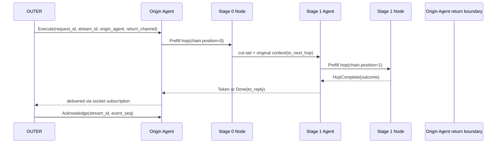
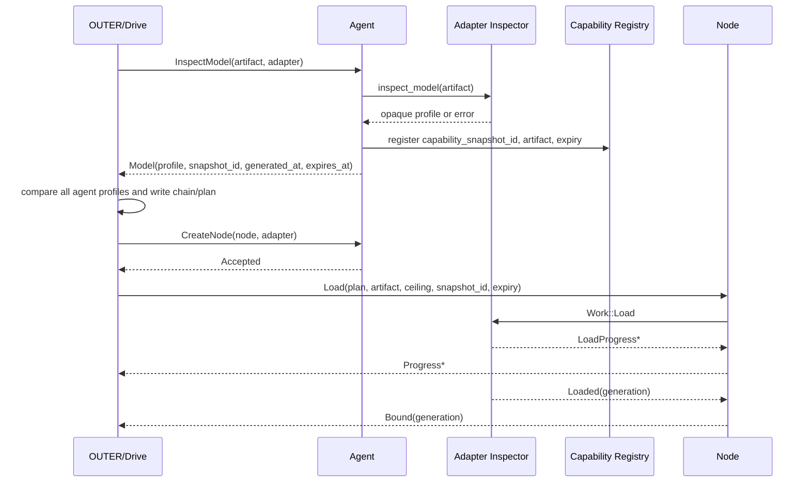
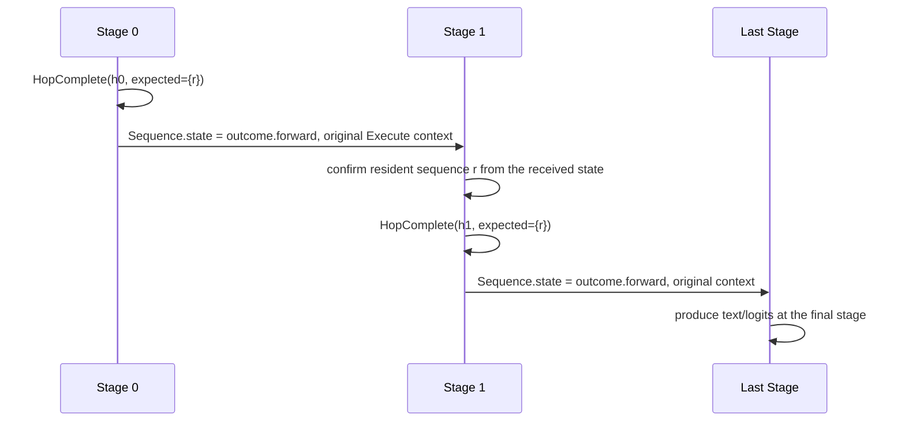
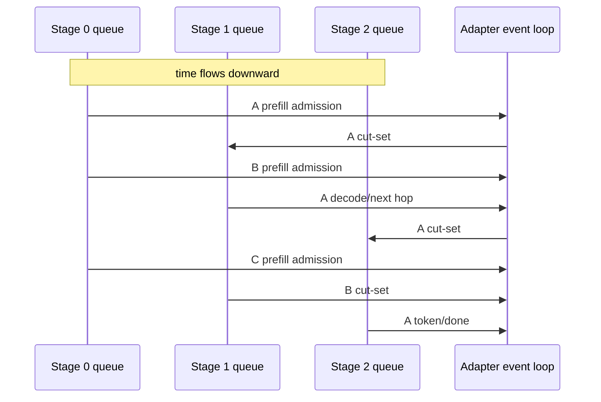
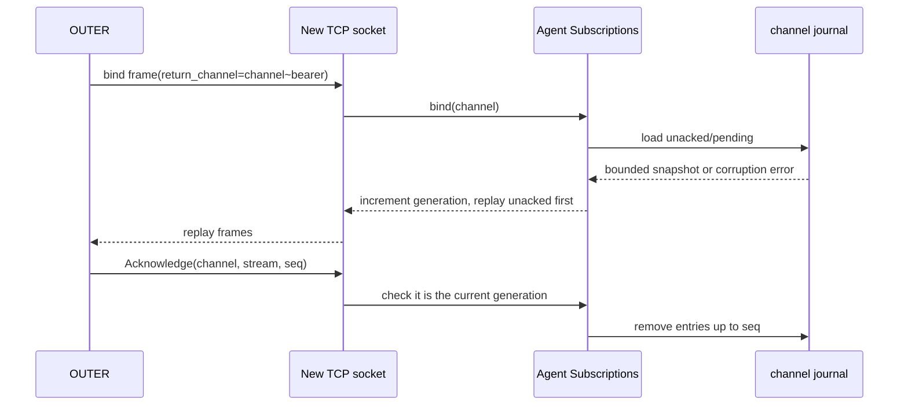
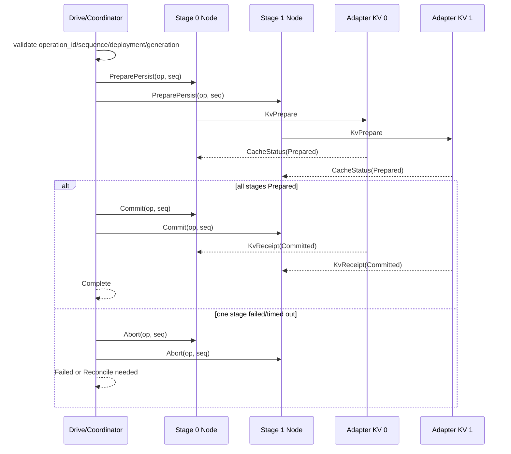
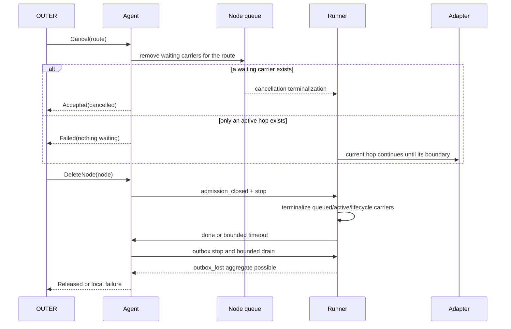
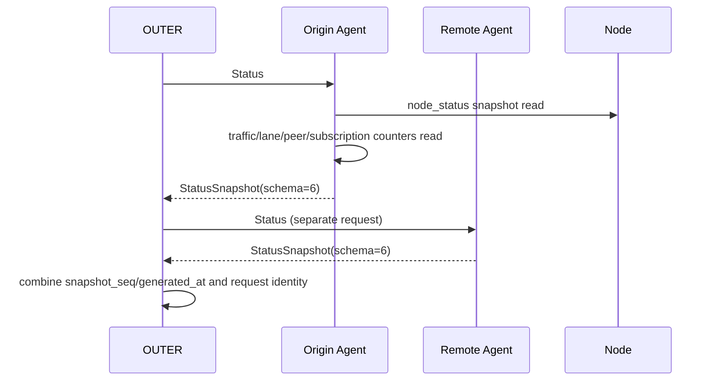
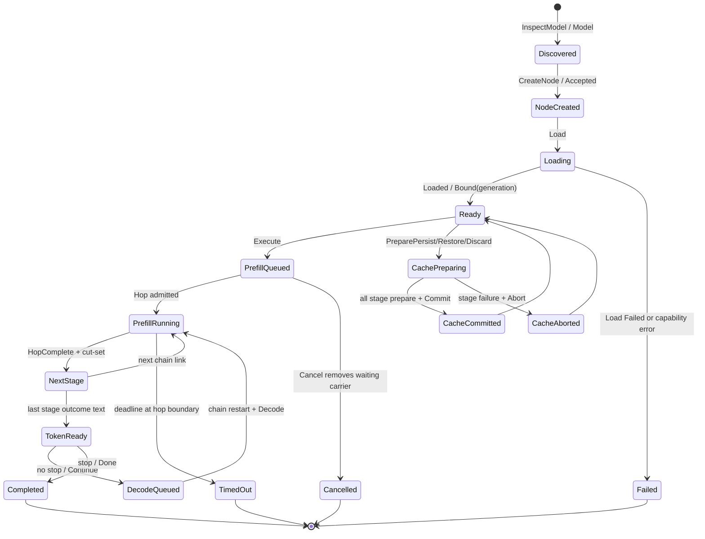

# P4 abstract protocol

> Document status (2026-09-06): **Per-path reference; re-audit required**. It includes the earlier Chain/Hop description and the decisions made at the time. Confirm the current guarantees of the event path against the code and the new verification conventions.
> Current goals, status and ordering follow the [execution roadmap](distributed-batching-roadmap.md); document authority and reading paths follow the [document map](document-map.md).

This document is the final contract of the current P4 implementation. It does
not record the past audit order or the history of fixes. It separates behaviour
confirmed by code and tests from boundaries that still need a policy.

## 1. Scope and responsibilities

P4 is an abstract transport and scheduling layer. It carries requests handed
over by OUTER between multiple agents/nodes and adapters, and returns the
results to the originating OUTER's logical channel.

| Responsibility | P4 contract | Owner |
| --- | --- | --- |
| Routing | Preserve the envelope's address, chain and request identity, and forward to the next hop | P4 |
| Execution | Bounded queue, hop admission, delivery of hop results and terminal states | P4 + adapter seam |
| Generation options | Carry the request body as a byte-preserving opaque payload | OUTER/concrete adapter |
| sampling/decoding | No semantic interpretation, no default selection, no switch translation | OUTER/concrete adapter |
| Model distribution plan | Query GGUF and adapter capabilities and build a placement plan | OUTER/drive + agent discovery |
| KV cache | Carry the operation identity and stage barrier, and reconcile receipts | P4 cache coordinator + adapter |
| Device and llama semantics | Forward backend reports as opaque text/capability | Concrete adapter |

`apps/p4/layers/adapters/llamacpp/upstream` is a replaceable external boundary.
The abstract layer does not depend on the llama.cpp private API, and other
adapters must be able to implement the same P4 seam.

## 2. Messages and identifiers

The wire frame is defined by `apps/p4/layers/protocol/src/envelope/` and
`apps/p4/layers/protocol/src/frame/`. The core fields of frame version 8 are
as follows.

| Field | Meaning | Invariance |
| --- | --- | --- |
| `target` | Address of the next consumer | May change per hop |
| `recipient` | agent/node name within that address | Validated at the receiving boundary |
| `route` | legacy shard/order key | Transport helper value, not the request identity |
| `request_id` | Identity of one inference request | Immutable for the whole life of the request |
| `stream_id` | One set of streaming responses | Immutable for the whole life of the response |
| `origin_agent` | The agent that first accepted the OUTER request | reply anchor |
| `return_channel` | OUTER logical return channel | Never inferred from a socket address |
| `event_seq` | Sequence number of a response event within a stream | Non-zero values increase monotonically |
| `hop_id` | Identity of one hop executed on one node | Echoed by completion; duplicates are rejected |
| `chain` | Ordered list of stages/nodes | Preserved across continuations |
| `operation_id` | Identity of a cache/lifecycle operation | Matches the request of that operation |

`origin_agent` is the normal return anchor. `reply_to` is used only as a legacy
or direct-delivery fallback. Token/terminal frames produced by the last node
keep `request_id`, `stream_id`, `return_channel` and `event_seq`, and return to
the origin agent and the OUTER channel.

## 3. OUTER return channel

An address identifies a listener, not an individual OUTER connection. A
production ingress `return_channel` must have the following form.

```text
<logical-channel>~<at-least-64-hex-digit-bearer>
```

This value is a possession/shape gate that binds the logical channel to the
accepted socket. It does not provide strong user or process authentication,
issuer verification, revocation or audience verification.

`Subscriptions` is a process-wide registry and applies the following policy.

- At most 1024 logical slots
- At most 1024 pending frames per channel
- At most 1024 unacked frames per channel
- On reconnect, binding the same channel replays unacked frames first, then pending frames
- Stale ACKs from a different socket generation are rejected
- Pending overflow drops the oldest frame; there is no protocol-level gap frame
- The registry does not claim an unknown channel; it sends it to the general fallback

The capability check uses an `rsplit` rule that treats only the last `~` as the
separator. The logical channel on the left must not be empty. The bearer on the
right must be at least 64 characters, representing at least 32 bytes, must have
an even length, and every character must be ASCII hex. The capability registry
holds at most 4096 entries. On insert it first removes expired entries; when a
new id is inserted into a full registry, it evicts the one entry with the
earliest `expires_at`.

An entrypoint with `P4_AGENT_STATE_ROOT` set can optionally use a channel
journal. Frames with a non-zero `event_seq` are written to the journal before
the socket write, and `(return_channel, stream_id, event_seq)` entries confirmed
by an ACK are removed. If journal read/write or the initial snapshot save fails,
or the journal is corrupt, the channel fails closed to generation `0` and
returns no replay. The default `Subscriptions` is process-local.

The following are intentionally not guaranteed.

- Power-failure durability, including fsync and parent-directory sync
- cross-process channel ownership
- journal compaction and disk quota
- Duplicate prevention after the socket write
- exactly-once delivery
- A durable delivery receipt that reaches the socket/OUTER

## 4. Request lifecycle and terminal rules

The logical states are as follows.

```text
accepted -> queued -> running -> yielded -> queued
                         |          |\
                         |          +-> completed
                         |             -> failed
                         |             -> cancelled
                         +--------------> expired
```

Each execution event must preserve `request_id`, the stage, `hop_id`, a
timestamp and a monotonic `event_seq`. The node rejects old generations, stale
hops, duplicate completions and incomplete completion sets.

Terminalization policy:

- A queued carrier produces a terminal error when it is rejected or cancelled.
- An active carrier terminates at the adapter's next hop boundary.
- lifecycle/cache carriers are also terminalized during node shutdown.
- If the adapter does not respond after the deadline, it may report a
  `timed_out` state, but forced native cancellation and immediate resource
  release are not guaranteed.
- If the outbox or downstream is closed, external delivery is not guaranteed,
  and the loss may be reflected in the `outbox_lost`/`event_loss` aggregates.

## 5. Pipeline parallelism and continuous requests

Each node runs one adapter hop at a time, but within one hop window it admits
sequences up to the ceiling declared by the adapter. Other requests enter the
bounded queues of the upstream and downstream stages, and when a stage is
empty, event-driven feeding puts in the next job.

Guaranteed:

1. A `hop_id` runs at most once on a node.
2. The adapter admission ceiling and the node queue depth are never exceeded.
3. Different requests can occupy different stages at the same time.
4. The main dispatcher normally polls in the order
   `Control > Response > Decode > Prefill`, but every 16th take lets the four
   lanes compete fairly. The node window does not prioritise `Decode`
   unconditionally. If live decode is filled up to the ceiling it picks Decode;
   if there is still headroom it picks Prefill first to fill admission. Decode
   priority is therefore a bounded preference, not a strict priority or a GPU
   utilization guarantee.
5. Downstream saturation results in bounded backpressure or an explicit refusal.
6. A stage's queued/running/idle/blocked state is reported only to the extent
   the typed status distinguishes it.

The P4 wire does not define global credit, min/max batch width, continuous
batching ownership, prefill/decode service-level guarantees or GPU utilization.
Mock overlap tests therefore prove that scheduling is possible, but they are
not evidence that a real GPU is always fed.

## 6. Queues, workers, CPS

Worker and queue responsibilities are as follows.

The default agent budget is `connections=1024`, `in_flight=256` and a common
lane `depth=4096`. These three values are independent. The lane defaults are
Control 1024, Prefill 4096, Decode 8192 and Response 4096; a budget of 0 is
rejected at startup as a validation error. Each peer outbound pump has its own
4096-frame queue, and a subscription socket is bounded both by the accepted
connection semaphore and by a per-channel queue of depth 1024.

- The central route worker uses the route hash to send the same route to the
  same worker and preserve order.
- When a worker inbox is full it returns a `try_send` refusal and does not wait
  indefinitely on another route.
- The main queue, lanes, peer queues, node ingress, adapter events and outbox
  all have bounded capacity.
- The adapter blocking worker sends events with `blocking_send`, and the node
  event loop waits for adapter completion without blocking the reader.
- Waiting for a process-wide adapter admission permit is async, so the node can
  keep receiving other arrivals/completions.
- An outbox producer may receive backpressure on a bounded send, but it does
  not switch to an unbounded retry/polling/sleep loop.
- Shutdown applies a bounded wait to the runner, the outbox and terminal
  carriers separately.

When a queue is saturated, the policy is a `queue_full` refusal with retry
guidance. P4 currently does not spill the general inference queue to disk.
Adding a persistent FIFO spill would require defining byte quota, ordering,
crash recovery and refusal/expiry rules as a separate wire policy.

## 7. Monitoring

The legacy `Status` string is kept for compatibility. The new status snapshot
is service message schema 6 and keeps reader compatibility with schemas 1–5.

What the current typed snapshot provides:

- snapshot sequence and creation time
- agent traffic/lane/peer/continuation aggregates
- node route/backend report
- queued request identity
- active `request_id`, `stream_id`, `hop_id`, phase, timeout marker
- subscription pending/unacked/dropped/ACK-rejected aggregates
- node `outbox_lost` aggregate

Not provided:

- per-event ACK/gap trace and per-socket delivery receipts
- intermediate peer queue depth/capacity/spill
- per-request enqueue/start/progress timestamps
- device activity, VRAM/KV residency, allocator trends
- durable history or exactly-once proof

`outbox_lost`, `event_loss` and `ack_rejected` are process-local aggregates, not
per-cause or per-request traces. A monitoring consumer must distinguish a value
of 0 from "not reported".

## 8. Generation requests and adapter portability

OUTER holds the concrete backend knowledge, such as the prompt, max tokens,
sampling/decoding parameters, grammar, structured output, stop/template and
backend launch switches, and builds the serialized request/options. P4 is
responsible only for the following.

1. Deliver opaque generation content byte-preserving.
2. Preserve the content across every hop and decode lap.
3. Check frame/body size and transport validity limits.
4. Never interpret fields to delete them or replace them with other defaults.
5. If the adapter does not understand the content, return an adapter-owned error.

The adapter translates the opaque content into its own API/process execution
arguments. Adapters other than llama.cpp can therefore implement the same P4
contract, and P4 does not define the semantics of any backend's sampling,
decoding or speculative features. However, after a successful prefill the
adapter must be able to deliver at least one token-bearing event for the
requested generation. Whether to put several tokens in one event or split them
across several Decode laps is the adapter's choice.

### 8.1 Decisions closed for this non-MTP/speculative scope

§8-3, §8-6 and §8-10 of the earlier draft are now fixed by the current code and
regression tests as follows. These decisions cover P4's bounded/mock/local
contract and the verified staged scope; they do not imply broader production
guarantees.

| Decision | Current contract | Basis |
| --- | --- | --- |
| identity ownership | `request_id` is immutable across the whole request and `route` is a transport key. `SequenceId` is derived from `request_id` at the payload boundary, `hop_id` is one execution pass on a node, and `stream_id`/`return_channel` are the return stream identity. Only legacy frames substitute `route` for an empty `request_id`. | `apps/p4/layers/service/src/payload/mod.rs`, `apps/p4/layers/service/src/payload/tests.rs`, `apps/p4/layers/protocol/src/envelope/mod.rs` |
| window/admission | `Load.ceiling` is the upper bound of node adapter admission. `compose` picks only one lane at a time and builds a window at or below that bound. The P4 wire does not own global credit, continuous batching or a GPU feed SLA. | `apps/p4/layers/agent/src/node/window/mod.rs`, `apps/p4/layers/agent/src/node/runner/`, `apps/p4/layers/agent/src/node/window/tests.rs` |
| KV transaction | Multi-stage cache work must pin `operation_id`, the sequence, the deployment generation and the stage set, and pass the prepare → commit or abort barrier. A wrong identity/phase or a partial commit results in failure or a compensating abort. | `apps/p4/layers/service/src/cache.rs`, `apps/p4/layers/service/tests/cache_barrier.rs` |
| MTP/speculative | Not a supported capability in this scope. Parser/ownership probes are not promoted to execution support, and such requests are rejected with `CAPABILITY_UNAVAILABLE`. | `buildplan.md` Gate 5, `apps/p4/layers/adapters/llamacpp/staged/server/src/server/` |

These four decisions are therefore no longer open questions for freezing the
non-MTP staged local frame. Production gates such as long-running native
execution, power failure, durable delivery and forced cancellation remain
separately in §11.

## 9. Model discovery and distributed loading

If OUTER does not know the model architecture itself, it asks the agent for
discovery before planning distributed loading. The agent/adapter returns the
following information, obtainable from the selected set of GGUF files, as an
opaque profile.

- artifact identity and file list/sizes
- model architecture and tensor/quantization profile
- context/embedding/layer capabilities
- the adapter/backend kinds that agent can actually provide
- VRAM/RAM requirements for placement and the range over which the model can be split
- profile snapshot identity and expiry

drive/OUTER checks the artifact and profile identity/expiry of every selected
agent, then decides the deployment chain and stage placement. At Load, the agent
re-verifies that the snapshot it received matches its own artifact and has not
expired. A discovery profile is not a hardware fingerprint or a durable
cross-process registry.

## 10. KV cache and cache transactions

`SequenceId` is derived from the immutable `request_id`; a `route` fallback is
allowed only for legacy frames. Cache work carries all of the following
identities.

- `operation_id` = the request identity of that cache operation
- sequence identity
- chain generation
- stage/node identity
- deployment identity

The supported operations are persist, restore, fork and discard. Multi-stage
save/restore uses the prepare → commit/abort barrier and proceeds only when each
stage receipt matches the operation, sequence, generation and stage. Stale,
duplicate or phase-mismatched receipts are rejected.

The P4 coordinator's multi-stage barrier and journal identity/recovery are
closed within the implemented and tested scope. The following are broader
production contracts needed on top of that; this change does not close them.

- A common format for adapter KV bytes and the manifest
- cross-file atomicity between receipt files and the coordinator journal
- native parity for crash recovery during `Committing`
- Windows/Linux power-failure recovery and long-term retention

## 11. Implementation and verification criteria

Main implementation locations:

| Area | Code |
| --- | --- |
| envelope/frame wire | `apps/p4/layers/protocol/src/envelope/`, `src/frame/` |
| agent ingress/replay | `apps/p4/layers/agent/src/transport/inbox/` |
| worker/queue | `apps/p4/layers/agent/src/agent/`, `src/queue/`, `src/node/` |
| node lifecycle/outbox | `apps/p4/layers/agent/src/node/runner/` |
| status/cache wire | `apps/p4/layers/service/src/message/`, `src/status/`, `src/cache*` |
| discovery/capability | `apps/p4/layers/service/src/capability.rs`, `src/payload/` |
| agent entrypoint | `apps/p4/entrypoints/agent/src/main.rs` |

Regression checks run directly at present:

- `cargo test -p p4-agent-core --lib`: 100 passed
- `cargo test -p p4-service --lib`: 62 passed (plus integration suites)
- Includes journal replay/corruption/slot bound, outbox shutdown, node lifecycle,
  status schema compatibility, cache barrier and message round-trip tests

These results are evidence of bounded mock/local correctness and of the
documented staged real-model scope. The system is not judged production ready
until it passes the broader production acceptance below.

### Broader production acceptance gates (intentionally open)

1. Long-running pipeline CPS, fairness, p95/p99 latency and resident
   memory/allocator trends with the native adapter on real GPUs
2. GPU feed-at-capacity and sustained prefill/decode overlap
3. process crash/restart and power-loss journal/KV recovery
4. reconnect gap/duplicate and a durable OUTER delivery policy
5. native cancellation, resource release, cross-process capability ownership

So that the document never claims stronger guarantees than the code, the items
above stay OPEN until verified.

## 12. P4 frame wire specification

The abstract P4 TCP frame is implemented in
`apps/p4/layers/protocol/src/frame/mod.rs`. A relay can interpret only the
envelope and preserve the body as raw bytes up to the destination.

### 12.1 Fixed header

All integers are little-endian.

| offset | Size | Meaning |
| ---: | ---: | --- |
| 0 | 4 | magic `P4B1` |
| 4 | 1 | frame version `8` |
| 5 | 3 | reserved, currently 0 |
| 8 | 4 | envelope byte length (`u32`) |
| 12 | 4 | body byte length (`u32`) |
| 16 | variable | envelope bytes, then body bytes |

The whole header is 16 bytes. The envelope is at most 256 KiB and the body at
most 2 GiB. `frame_len()` computes the total length declared by the header but
does not decode the body. `decode()` succeeds only if the actual input length is
exactly the value computed from the header.

The frame version is checked before the body (`frame_len()` checks
`header[4] != VERSION` before slicing the body). This property lets admission be
blocked by the version alone, without a new message catalogue or handshake. The
bump from 7 to 8 happened because `SessionClose`/`SessionClosed` in §13.2 became
an acknowledge contract
-- instead of a mixed fleet (old one-way close, new acked close) running as if
healthy and then, on the first early termination (EOS well short of the length
bound), silently leaking only the old-version stage's reservation, both
directions are rejected clearly before admission. If a zero-downtime
mixed-fleet upgrade becomes necessary, it will be negotiated through agent
`HELLO` and a separate feature set, not the frame version itself
-- that is not in this scope.
If any of magic, version, length or envelope decode fails, the whole frame is
rejected. `reseal()` changes the envelope and keeps the body bytes unchanged.

### 12.2 Envelope wire fields and validation

The envelope wire order is as follows.

```text
target Address
recipient tag [, node id]
lane tag
route text
request_id text
stream_id text
origin_agent present flag [, Address]
return_channel present flag [, text]
event_seq u64
deadline_unix_ms u64
reply_to present flag [, Address]
chain present flag [, Chain]
```

Text is `u32 byte_length + UTF-8 bytes`, and the maximum text size of an
envelope primitive is 256 KiB. An optional present flag allows only
`0=absent` and `1=present`. Any other flag, a truncated field, invalid UTF-8 or
trailing bytes is a `ProtocolError`.

- `request_id` and `stream_id` cannot be empty in wire encode/decode.
- If a chain is present, `origin_agent` and `return_channel` must also be present.
- A present return channel cannot be an empty string.
- `ingress_generation` exists in the envelope struct but is not written to the wire.
  Its decoded value is 0, and the accepted-socket reader injects it as local metadata.
- `return_key()` is not a wire field; it is a process-local key built as
  `len(request_id):request_id + len(stream_id):stream_id +
  len(return_channel):return_channel`.

Addresses currently support only `tcp://host:port`. The scheme must be `tcp`,
the host must not be empty, and the port must be a number in 1..=65535. For an
IPv6 host, the port is split off at the last colon.

### 12.3 recipient, lane, chain

`recipient` is one of the following two.

| tag/concept | Meaning |
| --- | --- |
| `Agent` | agent-owned work such as node registry, inspect, status, cancel, ACK |
| `Node(node_id)` | materialized node work such as load/unload, execute/continue, cache |

`QueueClass` is carried in the envelope and selects the lane without reading the body.

| lane | Meaning | Default main depth |
| --- | --- | ---: |
| `Control` | create/delete/inspect/status/cancel/ACK | 1024 |
| `Prefill` | First hop of a new prompt | 4096 |
| `Decode` | Next lap of a request that holds KV | 8192 |
| `Response` | token/progress/terminal/cache reply | 4096 |

Each `Link` of a chain has `address`, `node`, `binding` and `generation`.
The wire layout writes `chain present flag`, `count u32` and `position u32`,
then each link as `address text`, `node text`, `binding text`, `generation u64`
in that order. count is at most 256, an empty chain cannot be created, and
position cannot go past the last link. If the chain position is the first link,
`is_first()` holds; if it is the last, `is_last()` holds.

- `to_next_hop()` increments position by one and changes target/recipient to the
  next link's address/node. The lane is kept.
- `to_next_lap()` resets the chain position to 0 and changes the lane to
  `Decode`.
- `to_reply()` prefers `origin_agent` and uses `reply_to` only when it is absent.
  It switches to the response lane and removes `reply_to`.
- `relay_home()` returns, as a one-time fallback target, the first link of the
  chain that differs from the failed target and is not the current agent itself.

## 13. Service body specification

The service body is implemented in `apps/p4/layers/service/src/message/`. Body
tags are fixed constants, not the enum declaration order, so reordering variants
does not change how existing peers interpret them. All text is
`u32 little-endian length + UTF-8`, and each text is at most 256 KiB. Trailing
bytes left at the end of the body, an unknown tag, truncation or invalid UTF-8
is `Malformed`.

### 13.1 Agent commands (`ToAgent`)

| tag | variant | Body fields | Handling |
| ---: | --- | --- | --- |
| 1 | `CreateNode` | `node: text`, `adapter: text` | Create a node in the registry and attach the adapter factory |
| 2 | `DeleteNode` | `node: text` | Close node admission, remove it after a bounded shutdown |
| 3 | `Inspect` | none | Return the agent's machine/backend snapshot |
| 4 | `Cancel` | `route: text` | Cancel the route in the waiting carriers of all nodes |
| 5 | `Status` | none | Return the typed status snapshot |
| 6 | `InspectModel` | `artifact: text`, `adapter: text` | The selected adapter inspects the artifact/GGUF profile |
| 7 | `Acknowledge` | `return_channel: text`, `stream_id: text`, `event_seq: u64` | ACK replay journal entries of that stream up to event_seq |

`CreateNode` fails without creating the node if the adapter name is not in the
registry. `InspectModel` is a discovery operation that does not change the
loaded deployment. `Acknowledge` first checks that the body channel equals the
envelope return channel; if they differ, it does not apply the ACK and only
increments the `ack_rejected` aggregate.

### 13.2 Node commands (`ToNode`)

| tag | variant | Body fields | queue/lifetime |
| ---: | --- | --- | --- |
| 16 | `Load` | `plan`, `artifact`, `ceiling: u32`, `capability_snapshot_id`, `capability_expires_at: u64` | lifecycle, runs exclusively |
| 17 | `Unload` | none | lifecycle, runs exclusively |
| 18 | `Execute` | `prompt`, `max_tokens: u32`, `options`, `session_epoch: u64` | prefill, starts a sequence |
| 19 | `Persist` | `sequence` | cache lifecycle, runs exclusively |
| 20 | `Restore` | `sequence` | cache lifecycle, runs exclusively |
| 21 | `Fork` | `sequence`, `into` | cache lifecycle, keeps the original and creates a new identity |
| 22 | `Discard` | `sequence` | cache lifecycle, deletes the durable copy |
| 23 | `PreparePersist` | `sequence` | transaction prepare |
| 24 | `PrepareRestore` | `sequence` | transaction prepare |
| 25 | `PrepareDiscard` | `sequence` | transaction prepare |
| 26 | `Commit` | `sequence` | Apply the prepared mutation |
| 27 | `Abort` | `sequence` | Cancel the prepared mutation |
| 28 | `Continue` | `remaining: u32`, `emitted: u32`, `options`, `state: bytes`, `session_epoch: u64` | Next step of a decode lap |
| 29 | `Reconcile` | `sequence` | Query the adapter receipt without mutation |
| 30 | `SessionClose` | `sequence`, `close_id: u64`, `session_epoch: u64` | lifecycle, runs exclusively, subject to acknowledgement |
| 31 | `SessionClosed` | `sequence`, `close_id: u64` | acknowledgement, not scheduled |

The plan of `Load` and the options of `Execute/Continue` are opaque text that P4
does not interpret. `ceiling` is the adapter admission ceiling declared by the
load, and P4 does not recompute it from backend information. The current node
runner uses `ceiling.max(1)`, so `ceiling=0` on the wire reaches the adapter as a
ceiling of 1. There is no policy yet that rejects 0 explicitly. If
`capability_snapshot_id` is empty or the expiry is 0 or already passed, the
production payload boundary fails before calling the adapter.

`Execute` carries the new sequence's prompt and the overall token bound.
`Continue` does not repeat the prompt; it carries only `remaining`, `emitted`,
`options` and `state`. `remaining` is the original request's bound and is
preserved across laps. `emitted` is the number of tokens P4 has streamed so far;
it is the count the bound enforcer keeps of its own output. How far the session
has progressed is a backend fact, so it lives inside `state`, and P4 does not
read it.

OUTER does not send `SessionClose`/`SessionClosed`. When the tail of the chain
observes an early termination (EOS before the length bound is reached) or a
termination nobody is listening to, the P4 core sends them directly to every
preceding link (`agent::node::outcome::close`). The sequence and failure
behaviour are as follows.

1. When the tail decides `Next::Finish`/`Next::Unheard`, it issues a separate
   `close_id: u64` for each preceding link of the chain and sends
   `SessionClose`. `close_id` is a local counter of the sender (the tail), not
   the `sequence` -- `sequence` (=`request_id`) is an identifier the caller can
   later reuse in another session (`Admission::retry` in `tools/drive`), so a
   delayed or corrupted ack cannot be fenced by `sequence` alone.
2. The receiving node removes its own reservation **only after** the adapter has
   actually raised `Event::Closed`, and sends back a `SessionClosed` that echoes
   the received `close_id` unchanged. There is no optimistic pre-application.
3. The receiving node is idempotent: a retransmission for a `sequence` it has
   already handled or has never heard of is always answered with
   `SessionClosed` (`p4_adapter::work::close::Close` states this as a contract).
4. The sender retransmits every 250ms, at most 5 times including the first
   send, until it receives the ack (`agent::node::runner::pending_close`).
   After 5 attempts it abandons the pending entry for that `close_id` and
   increments `Counts::session_close_abandoned` -- the sender itself does not
   hold the peer node's reservation, so abandoning is not a leak on the sender
   side, but it leaves a signal the operator can see that the peer's
   reservation may never be cleaned up.
5. `SessionClosed` looks up the pending entry by `close_id` only. If `close_id`
   matches but the echoed `sequence` differs, the ack is treated as corrupted
   and dropped; if the `close_id` itself is absent (already cleaned up, already
   abandoned, never sent by this node), it is dropped as stale -- both cases
   increment `Counts::session_closed_stale` and change no state.
6. `SessionClosed` is delivered directly to the node that sent the close, as
   `Recipient::Node`. `Envelope::to_reply` (→ `origin_agent`) is not used --
   `origin_agent` is the anchor for returning to OUTER, and the ack must go to
   the peer node that sent the close, not to OUTER. The ack envelope therefore
   clears `chain`, `origin_agent` and `return_channel`.

### 13.3 Reply body (`Reply`)

| tag | variant | Fields | Meaning |
| ---: | --- | --- | --- |
| 32 | `Accepted` | `detail` | The command/job was admitted |
| 33 | `Progress` | `stage: u32`, `percent: u32` | Load stage progress |
| 34 | `Bound` | `generation: u64` | Generation in which the deployment was materialized |
| 35 | `Released` | none | unload/delete complete |
| 36 | `Token` | `index: u32`, `text` | Generated token-bearing event |
| 37 | `Done` | `reason`, `generated: u32` | Normal/stop terminal |
| 38 | `Failed` | `detail` | Generic failure, no cache identity |
| 39 | `Machine` | `snapshot` | legacy machine/discovery text |
| 40 | `Status` | `snapshot` | legacy human-readable status text |
| 41 | `Cached` | deployment, stage_id, generation, operation_id, sequence, bytes, detail | Cache mutation complete |
| 42 | `Model` | artifact, adapter, profile, capability_snapshot_id, generated_at, expires_at | Model discovery result |
| 43 | `StatusSnapshot` | typed snapshot | schema 1..6 monitoring |
| 44 | `CacheFailed` | deployment, stage_id, generation, operation_id, sequence, detail | Identity-bearing cache failure |
| 45 | `CacheStatus` | deployment, stage_id, generation, operation_id, sequence, state, bytes, detail | Receipt reconciliation result |

Whether `Token`'s `text` may be empty is decided by the adapter result, and
terminal status is distinguished by `Done` or the adapter's `Outcome.stop`. The
current outcome conversion judges an outcome with `stop=Some` as terminal
first, so even when text and stop are both present it produces only `Done` and
no separate `Token`. This is not a rule that guarantees the final token and the
terminal together. `CacheFailed` is produced only when both the current chain
link and the cache work can be identified. Without that information it falls
back to the generic `Failed`.

## 14. Agent duties and body consumption order

The consumption order of the `Standard` duties is as follows.

1. The core worker evaluates the envelope target/recipient. It can relay without
   reading the body.
2. If the target is the current agent and the recipient is `Agent`, the body is
   passed to `decode_to_agent()`.
3. A decode failure is returned as `Reply::Failed` with the detail
   `unreadable agent message`.
4. Agent commands run as follows.

| Command | Success | Failure/side effects |
| --- | --- | --- |
| CreateNode | `Accepted`, asynchronous node creation | `Failed` for an unknown adapter |
| DeleteNode | `Released` after shutdown | `Failed` for a missing node |
| Inspect | `Machine` | The snapshot keeps adapter/backend text opaque |
| InspectModel | `Model` + capability registry insert | `Failed` on an adapter inspection error |
| Cancel | `Accepted` if a waiting route exists | `Failed` if not found |
| Status | `StatusSnapshot` | Typed schema layout errors are rejected at decode |
| Acknowledge | Remove journal events | channel mismatch/stale generation is an aggregate rejection |

5. If the target is a node, the body goes through `decode_to_node()` and then
   branches to the lifecycle or sequence path. Unsupported bodies are rejected
   before node admission.

A response frame uses `Envelope::to_reply()` to make the origin agent its
destination. A response with no reply handler and no bound return channel is
not treated as a silent success; it passes through the fallback/duties boundary
and may be reflected in `unrouted` or a loss counter.

## 15. Typed status layout in detail

Currently `MIN_SUPPORTED_SCHEMA=1` and `MAX_SUPPORTED_SCHEMA=6`. The schema is
checked first, so a schema of 0 or greater than 6 is rejected before the
remaining bytes are read.

### 15.1 Common fields

`StatusSnapshot` has the following.

```text
schema: u16
snapshot_seq: u64
generated_at_unix_ms: u64
address: text
traffic: forwarded, consumed, to_nodes, unrouted, refused, emergency_lost
lanes: control, prefill, decode, response
peers: usize
continuations: usize
subscription_pending: usize
subscription_unacked: usize
subscription_dropped: usize
[schema >= 2] subscription_ack_rejected: usize
nodes: NodeSnapshot[]
```

On the wire, schema is written as `u32` and the aggregate counts above are
written as `u64`. Each node is always written in the order `node`, `depth`,
`running`, `backend`; from schema 6 the node-local `outbox_lost` aggregate is
inserted after that. Then come `waiting[]`, the waiting requests for schema 3
and later, and the active hop for schema 4 and later. `outbox_lost` is not a
top-level aggregate.

### 15.2 Schema extensions

| schema | Additions/defaults |
| ---: | --- |
| 1 | Common snapshot, waiting route strings |
| 2 | Adds `subscription_ack_rejected` |
| 3 | Adds route/request_id/stream_id/lane/deadline of waiting requests |
| 4 | Adds active hop marker, id, phase, request array |
| 5 | Adds the active hop `timed_out` marker |
| 6 | Adds `outbox_lost` after each node's `backend` |

When an older schema is decoded, missing values are restored as ACK count 0,
outbox loss 0, an empty waiting request array, active hop `None` and timeout
false. Lane tags are `0=Control, 1=Prefill, 2=Decode, 3=Response`, and phase
tags are `0=Prefill, 1=Decode`. The active-hop marker and the timeout marker
each allow only 0/1.

This snapshot is a bounded best-effort projection. The traffic, lane,
subscription and node fields are each read separately and then packaged under
one `snapshot_seq`, so even within a single agent it does not mean all fields
were read at one atomic point in time. `snapshot_seq` is a value for comparing
order, not a log offset that stores every request event.

## 16. Adapter abstract boundary

The trait in `apps/p4/layers/adapters/adapter/src/lib.rs` exposes only the following.

```text
inspect_model(artifact) -> Result<opaque profile, error>
distribution() -> Distribution
start(work, event_sink) -> returns immediately
report() -> cheap opaque backend text
```

`start()` neither returns a result nor makes the caller wait. The adapter posts
events asynchronously to the `EventSink`, and the node runner decides the next
job. `report()` is called from status requests, so it must not do blocking work.

### 16.1a `Distribution`

An adapter reports one of two model distributions: `Internal` or `Staged`.

| Value | Meaning | chain usage |
| --- | --- | --- |
| `Internal` | The backend owns tensor/pipeline parallelism and device boundaries internally and exposes one entry point | Only one chain link allowed |
| `Staged` | The P4 chain owns the layer range boundaries, and each node materializes part of the model | Stages across multiple links allowed |

`can_be_a_stage()` is true only for `Staged`. P4 reports `Distribution`, and
OUTER/drive, which decides placement, uses it. A node must not address the
internal shards of an `Internal` adapter as if they were separate chain nodes.

### 16.1b `Work`

`Work` has four kinds: `Load`, `Unload`, `Hop` and `Cache`.

`Load`:

```text
deployment: String
plan: String                  # opaque placement/backend plan
artifact: String
capability_snapshot_id: String
capability_expires_at: u64
```

`Hop`:

```text
id: u64                       # one execution pass
deployment: String
phase: Prefill | Decode
sequences: Sequence[]
```

Each `Sequence`:

```text
sequence: SequenceId
prompt: Option<String>
state: Option<bytes>          # opaque adapter bytes; P4 never reads them
remaining: u32
options: String               # opaque generation options
```

`state` is an opaque byte value that the adapter writes and only the adapter
reads; it comes back unchanged on the next hop. Position, the sampled token,
the tensor cut-set and its batch used to be separate fields; now they all live
inside this single `state`. P4 does not interpret its contents and passes it,
exactly as the adapter wrote it, as the next `Sequence.state`.

`prompt` exists only for the first stage or an internal backend. Later staged
stages do not re-interpret the prompt; they use their own resident `state`.
`remaining=0` is the terminal boundary at which no further sequence is reserved.

### 16.2 Adapter `Event`

| event | Fields | Meaning for the node |
| --- | --- | --- |
| `LoadProgress` | deployment, stage, percent, detail | Per-stage load progress |
| `Loaded` | deployment, generation, allocations[] | Executable materialization |
| `Unloaded` | deployment | Deployment release complete |
| `HopComplete` | hop_id, deployment, expected[], outcomes[] | End of the current hop and queue re-evaluation |
| `Cached` | deployment, stage_id, generation, operation_id, sequence, bytes, detail | Cache mutation complete |
| `CacheStatus` | the identity above + state, bytes, detail | Receipt query result |
| `Failed` | deployment, sequence?, hop_id?, detail | Terminal failure of that work |

`Allocation` is `category: String`, `bytes: u64`. The meaning of an allocation
category is owned by the adapter. `HopComplete.expected` is the sequence set the
adapter actually received, and the node compares it exactly with its in-flight
set.

Each `Outcome`:

```text
sequence: SequenceId
forward: Option<bytes>        # opaque adapter bytes, handed back as the next Sequence::state
text: String
stop: Option<String>
```

A sequence is terminal only when `stop` is Some. A middle staged node may have
empty text. Only the last node or an internal backend produces text/logits
results. `forward` is the opaque backend state handed to the next stage, and on
the next hop it becomes `Sequence.state` unchanged.

## 17. Cache/KV abstract specification

### 17.1 P4 cache work

`Cache` is exclusive lifecycle work for one sequence.

```text
deployment: DeploymentId
stage_id: String
generation: u64
operation_id: String
sequence: SequenceId
action: Reconcile | PreparePersist | Persist | PrepareRestore | Restore |
        PrepareDiscard | Fork(into) | Discard | Commit | Abort
```

`subject()` returns `into` for `Fork` and the original sequence otherwise.
`operation_id` ties the whole multi-stage transaction together, and the stage
generation prevents stale KV from being restored into a rebound deployment.

Receipt states are `Absent`, `Prepared`, `Committed`, `Aborted` and
`Inconsistent`. `Inconsistent` means a receipt exists but the
manifest/identity/checksum does not match, so it cannot be treated as a
replayable success.

### 17.2 Coordinator state

The service coordinator's transaction kinds are `Persist`, `Restore` and
`Discard`. The phases/states are as follows.

```text
Preparing -> Committing -> Complete
     |             |
     +-> Aborting -+
     +-> Failed
Reconcile queries each stage receipt without mutation
```

Creating a transaction requires an operation id, a sequence, a deployment, a
non-zero generation and a non-empty, unique stage set. The barrier advances
only when each stage's prepare/commit/abort receipt matches the operation,
sequence, deployment, generation and stage. An unknown stage, a duplicate
completion, a receipt that does not match the phase, or a checksum error stops
recovery.

The coordinator journal can leave intent and progress as durable
snapshots/records, but it does not substitute for the KV bytes the adapter
actually stores, nor for cross-file atomicity.

### 17.3 llama.cpp staged private adapter wire

The following is not the P4 abstract wire but a separate implementation
protocol between the staged adapter and the local server. It is implemented in
`apps/p4/layers/adapters/llamacpp/staged/adapter/src/protocol/`.

| Item | Value |
| --- | --- |
| magic | `LCP4` |
| revision | `u16 = 1` |
| header | 12 byte |
| body length | `u32` at header offset 8 |
| Default max frame/payload | 128 MiB |
| Default max descriptors | 16384 |
| Default max name | 4096 byte |

The private header is, in order, `magic`, revision, operation `u8`, reserved
flags `u8=0` and body length `u32`. The operation tags are as follows.

| tag | operation |
| ---: | --- |
| 1 | `Hello` |
| 2 | `Hop` |
| 3 | `HopResult` |
| 4 | `Cancel` |
| 5 | `KvSave` |
| 6 | `KvRestore` |
| 7 | `KvDrop` |
| 8 | `KvResult` |
| 9 | `Unload` |
| 10 | `Error` |
| 11 | `KvPrepare` |
| 12 | `KvCommit` |
| 13 | `KvAbort` |
| 14 | `KvReconcile` |
| 15 | `KvReceipt` |

An unknown operation, a non-zero reserved flag, a wrong revision, bad magic, a
body length mismatch or exceeding the frame limit is a private frame error.
Success on this private wire does not mean P4 OUTER delivery succeeded.

### 17.4 Private KV payload

`KvPayload` has the following order.

```text
sequence_id text
cache_key text
model_identity text
stage_begin i32-as-u32
stage_end i32-as-u32
flags u32
expected_checksum text ("-" if absent)
[may be omitted in a legacy direct frame]
operation_id text
```

Validation rules:

- The private frame and body are each at most 128 MiB, and the sequence id must
  be non-empty and at most the configured `max_name_bytes` (default 4096 bytes).
  The operation id follows the same length limit; it may be omitted in direct
  legacy KV and is required for transaction verbs.
- The cache key is at most 256 bytes and allows only ASCII alphanumerics and `.` `_` `-`
- Model identity at most 4096 bytes, receipt detail at most 4096 bytes
- `stage_begin >= 0`, `stage_end > stage_begin`
- flags are 0..=3
- The expected/result/receipt checksum is `-` or a UTF-8 string of exactly 64
  bytes. The implementation does not separately enforce that the checksum
  characters are hex.
- Every field must be consumed; trailing bytes are rejected

`KvResult` returns the sequence id, cache key, bytes and a 64-byte checksum.
`KvReceipt` carries the operation id, sequence id, cache key, model identity,
stage range, kind, state, bytes, checksum and detail. The private receipt state
tags are `0=Absent, 1=Prepared, 2=Committed, 3=Aborted,
4=Inconsistent, 5=Committing`. `kind=0` is allowed only with Absent or
Inconsistent.

### 17.5 Private HOP payload

The `Operation::Hop` body uses the v2 `HMUX` envelope. A legacy one-sequence
body and an old HMUX body can still be decoded, but they are marked
`legacy=true`, and an execution without phase and stage-zero metadata is never
used for a real llama hop.

```text
4 bytes  magic = HMUX
1 byte   envelope version = 2
1 byte   phase: 0=Prefill, 1=Decode
2 bytes  reserved flags = 0
4 bytes  sequence count
repeat sequence count:
  4 bytes sequence record length
  sequence record
```

An empty sequence list, exceeding the max descriptor count, an unknown phase, a
non-zero reserved flag or trailing envelope bytes is rejected. The v2 optional
flags of a sequence record mean the following, starting from bit 0. The actual
byte order is `prompt`, `initial_tokens`, `position`, `outcome`, `options`,
followed by the common tensor body.

| bit | optional field |
| ---: | --- |
| 0 | prompt text |
| 1 | initial token count + signed `i32` token ids |
| 2 | outcome metadata |
| 3 | position `u32` |
| 4 | options text |

Outcome metadata is `token: i32`, `position: u32`, `text`, `has_stop` and an
optional stop text. Reserved flag bits must be 0. The prompt is sent only to
stage zero; middle stages do not receive it. Initial tokens are present only
when a caller that has already tokenized sends them. Empty options are omitted
from the v2 body.

The common tensor payload of each sequence has the following order.

```text
sequence_id text
descriptor count u32
repeat descriptor count:
  wire_type u8
  rank u8
  dimensions[rank] u64
  strides[rank] u64
  nbytes u64
  view_offset u64
  alias_of u32 (u32::MAX = no alias)
  flags u8
  name text
  [non-alias only] payload length u64 + payload bytes
[optional] magic NTOK + n_tokens u32
```

The supported `wire_type` values are `F32=1`, `F16=2`, `Q8=3`, `Q4=4` and raw
`Bytes=255`. rank is at most 8, and the descriptor and payload arrays must have
the same length. A non-alias descriptor must have exactly `nbytes` of payload,
and an alias descriptor must not have a payload. An alias target cannot point to
itself or out of range. The total payload is at most 128 MiB, the
descriptor/initial-token/sequence counts are each at most 16384, and
`n_tokens=0` is
rejected. `n_tokens` is an explicit logical token count, not an estimate from
the tensor dimensions.

`HopResult` returns the result descriptor/cut-set and outcome metadata based on
the same sequence context. `Operation::Cancel` is a cooperative cancel request
for the stage server's current operation; it is not the same route cancel
command as P4's `ToAgent::Cancel`. `Operation::Unload` is a deployment release
request to the private server.

### 17.6 Private HELLO and capability

The client sends the protocol revision `u16` in the `Hello` body. The server
response body carries the same revision and an optional UTF-8 id/feature text;
if the feature text contains `transactions=1`, the Rust staged adapter can use
the `KvPrepare/Commit/Abort/Reconcile` transaction verbs. Without that feature,
the Rust side falls back to the legacy/process-local barrier path and does not
send transaction verbs unconditionally. A successful HELLO proves only stage
server protocol compatibility; it does not prove model load, KV recovery or P4
OUTER delivery.

## 18. Discovery and placement data flow

OUTER does not guess the model knowledge needed for distributed loading.

```text
OUTER/drive
  -> ToAgent::InspectModel { artifact, adapter }
  -> the selected adapter::inspect_model() on the origin agent
  -> Reply::Model { artifact, adapter, profile,
                    capability_snapshot_id, generated_at, expires_at }
  -> OUTER compares all stage profiles and builds the placement plan
  -> ToNode::Load { plan, artifact, ceiling, snapshot_id, expiry }
  -> each agent verifies the artifact/expiry/snapshot match
```

`Model.profile` is a string that P4 does not interpret. "Compares all stage
profiles and builds the placement plan" in the sequence above is a cooperation
rule describing the OUTER/drive orchestration responsibility. It is not a
guarantee that the P4 agent itself compares the whole fleet or blocks `Execute`
until every stage is `Bound`. drive correlates replies by route and return
channel, and rejects artifact mismatches, empty snapshot ids, profile
mismatches and expiry errors. The capability registry's local match checks the
current artifact and expiry, but does not provide adapter/profile issuance
ownership. Cryptographic provenance for profiles and cross-agent revocation are
therefore not yet protocol guarantees.

## 19. Error and compatibility table

| Boundary | Error form | Failure behaviour |
| --- | --- | --- |
| P4 frame | `ProtocolError` | Stop frame decode/ingress |
| envelope primitive | `ProtocolError` | Reject the malformed envelope |
| service body | `Malformed` | Respond if the body handler can build an identity-bearing `Failed` |
| payload decode | `Option::None`/validation error | Reject before node/adapter admission |
| agent duties | `Reply::Failed` | Send a generic detail to the requester |
| load capability | lifecycle error | Reject before calling the adapter |
| active hop event | invalid/orphan counter | Do not apply stale/partial completions |
| cache receipt | identity/phase error | Stop the transaction barrier or abort |
| socket write | I/O error | reconnect/one-time relay/loss accounting |
| journal | corrupt/I/O | opt-in channel fails closed to generation 0 |

Wire tags are fixed explicitly, so a new variant must not reuse an existing tag;
it must add a new tag and a compatibility test. A status schema change needs
both a bump of `MAX_SUPPORTED_SCHEMA`, so that existing readers do not guess the
new layout, and reader/writer tests. Changing the meaning of an envelope field,
changing chain/link identity, or changing cache operation identity is a larger
compatibility change than adding a simple body variant.

## 20. Detailed specification versus current evidence

The following are specifications that the current source and unit/integration
tests cover directly.

- P4B1 frame framing, envelope validation, fixed body tags and round-trip
- request/stream/channel identity and chain hop transformation
- bounded lane/worker/node/outbox admission and refusal
- active hop id and exact completion set validation
- token/done/failed/cache/status reply encoding
- status schema 1..6 reader/writer compatibility
- capability expiry/artifact validation and the model discovery reply
- mock cache barrier and coordinator journal recovery

The following are areas where the detailed fields exist but real-environment
guarantees have not been confirmed.

- A receipt that a real TCP peer consumed the frame up to the application
- Atomicity of the OUTER journal and native KV right after a process crash/power loss
- exactly-once streaming responses with no duplicates or gaps
- capability issuer, revocation and cross-process ownership
- Forced cancellation and full resource release in the native adapter
- Pipeline feed, CPS, latency and memory in long real llama.cpp/GPU runs

The field/encoding specifications in this document are therefore the wire
contract implementers must follow, and the last list is the acceptance gate for
proving that contract in a real environment.

## 21. Per-command execution specification

This section defines each body variant as an independent protocol operation.
All operations share the following envelope conditions.

- `target` must be the address of the agent that consumes the command.
- Agent commands must have `recipient=Agent`, and node commands
  `recipient=Node(node_id)`.
- Commands that need a request-response must have `request_id`, `stream_id`,
  and `origin_agent` or legacy `reply_to`. If `to_reply()` is `None`, the
  command is fire-and-forget and no reply body is produced.
- `route` is only a transport key for cancellation and legacy continuation; it
  does not replace the request identity.
- If the request carries a chain, the current chain link's `address`, `node`,
  `binding` and `generation` must match the target node.

### 21.1 `CreateNode`

**Direction:** OUTER/drive → agent, `Control` lane, `recipient=Agent`.

**Input:** `node` is the node id used inside the agent, and `adapter` is an
adapter kind registered in that agent's registry. Both are text, and the meaning
of an empty value is not separately defined. An unknown adapter is a placement
error.

**Processing order:**

1. The registry looks up the adapter factory.
2. If the factory cannot build an adapter for the node, `Failed` is produced immediately.
3. On factory success, the agent creates a node handle with an initial ceiling of 1.
4. The node registry work runs in a separate async task, and the duties worker
   does not wait on the factory or the node lock.

**Success:** `Reply::Accepted { detail: "node ... created on ..." }`. If a node
with the same `node` id already exists, the new handle is registered and the
previous handle gets a bounded shutdown. Resending the same request is therefore
a replacement operation, not a simple lookup-style idempotent call.

**Failure:** `Reply::Failed` if the adapter kind is not registered; without a
reply route, even the failure does not go out on the wire. The node's actual
model materialization after create is a separate `Load`. A successful
`CreateNode` alone does not make the node ready for inference.

### 21.2 `DeleteNode`

**Input:** `node` id. Requests a shutdown boundary that can terminalize all of
that node's queued/active/lifecycle carriers.

**Processing:** Closes node admission, delivers stop, then applies a bounded
wait to the runner and the outbox. For an active adapter hop, the policy is to
wait for the adapter's next hop/terminal boundary, not to force a native stop.

**Success:** `Reply::Released` after shutdown completes. The node status
registry shows the same handle during shutdown, and if the same id was
concurrently replaced, the replacement is not deleted.

**Failure:** `Reply::Failed { "no node ..." }` if the node does not exist. Even
if local shutdown returns after a timeout, downstream/OUTER terminal delivery is
not confirmed as successful, and `outbox_lost` may increase.

### 21.3 `Inspect`

**Input:** no body. The machine snapshot carries machine-owned facts such as the
adapter kinds registered by the current process and the platform/address.

**Success:** `Reply::Machine { snapshot }`. The snapshot text is a
legacy/opaque representation, and P4 does not reinterpret GPU model, VRAM or
driver semantics.

**Re-run:** It is a read-only snapshot, so repeating the request does not change
model load or node state. `Machine` is not the model profile of a specific
artifact. Artifact knowledge comes from `InspectModel`.

### 21.4 `InspectModel`

**Input:** `artifact`, `adapter`. Only adapters registered in the agent registry
can be selected. The adapter instance only calls `inspect_model()` and must not
change the loaded deployment.

**Processing and identity:** The agent takes the inspection start time as
`generated_at` and computes a default 5-minute expiry. The agent generates the
capability id and keeps the profile and artifact/adapter in its local
registry. Inspection runs the blocking adapter API with `spawn_blocking`.

**Success:** `Reply::Model { artifact, adapter, profile,
capability_snapshot_id, generated_at, expires_at }`. The profile may contain
GGUF/model architecture/tensor facts, but P4 does not interpret the string.

**Failure:** If the adapter cannot read the artifact or does not support
inspection, the adapter error is returned as `Reply::Failed`. Returning a
guessed profile is not success.

**Re-run/validity:** Inspecting the same artifact again produces a new snapshot
id and expiry. A later Load must send the snapshot id, artifact and expiry, and
an expired snapshot is rejected before the adapter is called. The current
registry `matches()` checks the artifact and expiry but does not
cryptographically verify adapter/profile provenance itself.

### 21.5 `Cancel`

**Input:** one `route`. The cancellation key in the current implementation is
the route, not request_id. If the route is empty or reused, it may differ from
the request the caller intended, so a new protocol must also manage the
immutable request identity.

**Processing:** Removes the route from every node's bounded waiting queue. An
active hop already handed off to the adapter is not forcibly interrupted.
Cancel therefore means "do not start the next hop", not "stop the current
backend call immediately".

**Success:** If at least one waiting carrier was removed, the cancel requester
receives `Reply::Accepted { detail: "cancelled ..." }`. The original request
receives, once per request, a terminal `Reply::Failed` that can be replayed via
`return_channel`. Additional queued carriers of the chain are discarded without
producing a duplicate terminal for the same request, and the number of discards
must be aggregated as a separate status observation.

**Failure:** `Reply::Failed { "nothing waiting ..." }` if there is no waiting
carrier. Already completed requests and active-only requests fall into this
result. A cancel reply is not a durable OUTER receipt that the work stopped.

### 21.6 `Status`

**Input:** no body, `Control` lane. Status collection reads node locks and
subscription metrics, so it runs in an async task instead of waiting in the
duties worker.

**Success:** `Reply::StatusSnapshot` with the current schema. When legacy peer
negotiation is used separately, `Reply::Status` text also exists, but new
consumers must use the typed snapshot.

**Consistency:** The snapshot is a bounded projection that reads several local
locks one after another; it is not an atomic snapshot of the whole distributed
system. `snapshot_seq` lets you compare the order of snapshots from the same
agent, but it is not a request event log offset.

### 21.7 `Acknowledge`

**Input:** the body's `return_channel`, `stream_id` and `event_seq`; the
envelope's `return_channel` must be the same logical channel. The
`ingress_generation` injected by the reader is not part of the wire body.

**Processing:** On a body/envelope channel mismatch, the ACK is discarded
immediately and only `subscription_ack_rejected` is incremented. If they match,
the current channel generation is compared with the generation, and the
stream's unacked frames with `event_seq <= given event_seq` are removed.

**Success/response:** An ACK has no reply of its own. If the accepted socket
generation is stale, nothing is removed and the call ends with false. P4 does
not judge whether a frame stored in the current journal was actually consumed
by the OUTER application.

## 22. Per-command specification for node execution and cache

### 22.1 `Load`

**Preconditions:** The current chain link must point to the target node, and
`artifact` and `capability_snapshot_id` must be bound to a discovery result.
`plan` is opaque text needed for placement and adapter launch. `ceiling` is used
as the adapter admission upper bound; 0 is treated as a boundary at which the
window admits no sequences.

**Conversion:** `Bodies::lifecycle()` turns it into `Work::Load`, taking the
deployment from the current chain `binding` and the snapshot fields from the
body. The node calls `start(Load, sink)` on the adapter.

**Events/response:** The adapter's `LoadProgress` becomes `Progress`, and
`Loaded` records the generation and becomes `Bound`. Execute for that generation
is allowed only after the load completes.

**Failure:** A missing/zero/expired/mismatched snapshot fails before the adapter
is called. An adapter load error is `Failed`. A partial load is not promoted to a
loaded generation. Re-Loading the same deployment follows the adapter/node
generation policy and is never silently treated as the existing generation.

### 22.2 `Unload`

**Preconditions:** The current deployment must exist, and the node's
queued/active work and lifecycle ordering apply. The node does not run an unload
arbitrarily in parallel with an inference hop.

**Success:** `Released` after the adapter's `Unloaded`; the deployment generation
can no longer be used as a valid bound for new hops.

**Failure:** An adapter unload error is `Failed`. Outbox frames left after the
unload follow the shutdown/backpressure rules, and Released does not mean an
OUTER receipt.

### 22.3 `Execute`

**Input:** `prompt`, `max_tokens`, opaque `options`. The first stage/internal
backend receives the prompt. The sequence identity comes from the envelope
`request_id` first, with a route fallback only for legacy frames. When the body
is interpreted as a sequence, it is built with `state=None` and
`remaining=max_tokens`.

**admission:** The node queue accepts the work, and the window composer can
group several sequences, up to the load ceiling, into one
`Hop { phase=Prefill }`. One Execute does not necessarily mean one adapter call.

**Success flow:** The adapter posts hop results as events. The last stage's
outcome text becomes `Token`, and a stop outcome becomes `Done`. Middle stages
send the cut-set to the next chain link. Without a stop, a `Continue` body is
built and the chain restarts on the next lap.

**Failure:** A malformed body, node queue refusal, stale hop, partial completion
or deadline expiry takes the carrier's terminal `Failed`/timeout path. Nothing
waits on the adapter call stack, so the arrival/completion of other requests is
not blocked.

### 22.4 `Continue`

**Input:** `remaining`, `emitted`, `options`, `state`; there is no prompt. P4
does not interpret options or state; it only guarantees that the values from the
previous Execute are preserved.

**Conversion:** It becomes a sequence of `Work::Hop { phase=Decode }`. `state` is
the previous hop's `Outcome.forward` handed back unchanged, and `remaining` is
the original request's bound. The lap restarts from the first stage of the
staged chain, so one decode lap can produce one token-bearing outcome.

**Termination:** If the outcome stop is Some, no further Continue is produced
and Done is built. If stop is None, the next lap is enqueued. `remaining=0` is
the boundary at which no new hop is reserved.

### 22.5 `Persist`

**Input:** `sequence`; the operation identity comes from the envelope
request_id, and the deployment/stage/generation come from the current chain.

**Meaning:** A single-sequence mutation that writes resident KV to the durable
adapter store and releases the resident memory. For a multi-stage deployment,
it is sent to each stage with the same operation identity.

**Success/failure:** adapter `Cached` → `Reply::Cached`; failure →
identity-bearing `CacheFailed`. `Cached.bytes` is the durable copy size; 0 has a
backend meaning such as discard. For a resend of the same already committed
operation, the coordinator must reconcile the receipt; the P4 body itself does
not create exactly-once behaviour.

### 22.6 `PreparePersist`

Records resident KV in a transaction prepare state instead of making it final
immediately. The coordinator does not send Commit until prepare has succeeded on
every stage. The adapter receipt must be `Prepared`; a `Committed` receipt or a
receipt for another operation is not interpreted as success.

### 22.7 `Restore`

Restores the durable KV of the same `sequence` into resident state so that the
next Execute/Continue can continue from it. Restore does not delete the durable
copy. The success receipt is a `Cached` that includes bytes and generation; if
the generation differs from the current deployment, the restore is rejected.

### 22.8 `PrepareRestore`

Prepares the restore result instead of committing it immediately as visible
state. When prepare receipts from all stages have arrived the result is Commit;
if some fail it is Abort. If resident state already exists, which rollback
snapshot the adapter keeps is owned by the adapter.

### 22.9 `Fork`

Copies the durable/resident state of `sequence` into a new sequence identity
named `into`. The original is not changed. The successful `Cached.sequence` is
`into`, not the original sequence, and the coordinator tracks the branch from
then on as a new operation/sequence. It is not assumed that an
alias/shared-prefix was created.

### 22.10 `Discard`

Removes the durable copy of `sequence`. The adapter reports when resident state
is cleared and how bytes are cleaned up. The success receipt bytes are usually
0, but the backend owns the exact value. A sequence that is already gone
becomes Absent or a failure depending on the adapter receipt, and P4 never
treats it as a success on its own.

### 22.11 `PrepareDiscard`

Prepares the discard as a staged mutation without yet deleting the durable copy
for good. The copy is deleted by Commit only when every stage is Prepared; an
error in between requires Abort to restore the original state.

### 22.12 `Commit`

Makes the previous prepare operation final. Commit is not a new independent
mutation but a transaction phase of the same envelope `operation_id`, sequence
and generation. A stage without a prepared receipt, a different operation id or
a different generation is rejected as a stale receipt. Success is `Cached` or
`CacheStatus(state=committed)`.

### 22.13 `Abort`

Asks the adapter to cancel the previous prepare mutation and restore the
pre-state.
Abort does not guarantee that it can magically undo a state already committed
externally; the adapter receipt must be checked for Aborted. A failure or
mismatch becomes `Inconsistent` and a reconcile target.

### 22.14 `Reconcile`

Reads only the adapter's durable receipt, without replaying the mutation. It
returns `Absent`, `Prepared`, `Committed`, `Aborted` or `Inconsistent` as
`CacheStatus`. This is the operation coordinator recovery uses after a process
restart to determine which phase was last settled. `Inconsistent` is neither a
success nor a retryable success; it requires manual/adapter-specific recovery.

## 23. Meaning and terminality of each reply

The replies below must be interpreted together with the envelope's original
request/stream/channel identity, not by the body tag alone.

| reply | Terminality | Production condition and consumption rule |
| --- | --- | --- |
| `Accepted` | non-terminal | Command admitted / cancel request received. A result may follow separately |
| `Progress` | non-terminal | Load stage progress. percent is an adapter report; completion is judged by `Bound` |
| `Bound` | lifecycle terminal | The deployment generation has become executable |
| `Released` | lifecycle terminal | unload/delete complete. Not a socket delivery receipt |
| `Token` | stream non-terminal | token index/text. A further Decode may follow |
| `Done` | inference terminal | Normal termination with reason/generated |
| `Failed` | request/work terminal | Generic detail; may have no cache identity |
| `Machine` | inspect terminal | process/machine snapshot text |
| `Model` | inspect terminal | Artifact profile and capability snapshot issuance result |
| `Status` | status response terminal | legacy text snapshot |
| `StatusSnapshot` | status response terminal | typed schema snapshot |
| `Cached` | cache-operation terminal | Mutation result and durable bytes |
| `CacheFailed` | cache-operation terminal | Failure carrying operation/sequence/stage identity |
| `CacheStatus` | reconcile terminal | Durable receipt query result; does not imply a mutation |

`Token` can be sent as a streaming response with an increasing event_seq, and
`Done` is the terminal frame carrying the last event_seq. A cut-set frame
produced by a middle node is not an OUTER reply, so it is not converted to
Token. If a reply cannot be delivered downstream, nobody outside can confirm
that the reply's meaning took effect.

## 24. Node application rules per adapter event

### `LoadProgress`

Checks that `deployment` matches the active lifecycle and forwards
stage/percent/detail as `Progress`. The backend meaning of the percent range is
adapter-owned. This event does not substitute for load completion or generation
issuance.

### `Loaded`

Binds the current deployment with the generation and the allocation report. The
adapter issues the generation; P4 does not compute it. The `Bound` for the
`Load` then goes out, and hop admission for that generation becomes possible. A
stale Loaded for the same deployment is not applied if it does not match the
current lifecycle identity.

### `Unloaded`

Signals that the deployment's resident state has been released. The runner
completes the lifecycle carrier and produces `Released`. From then on,
cache/execute for that generation is not allowed without re-verification.

### `HopComplete`

The event the node validates most strictly.

1. `hop_id` must equal the current active hop.
2. The deployment must equal the currently bound deployment.
3. The `expected` set must equal the current in-flight sequence set.
4. The sequence set of the outcomes must be exactly equal to expected.
5. If any sequence is duplicate, foreign or missing, the hop as a whole is not treated as a success.

If validation passes, the in-flight entries are removed, the node queue permit
is returned, and each `Outcome` is converted into one of: next stage, Token,
Done or Continue. A validation failure is not applied to a new hop and follows
the invalid/orphan counter and the terminal failure policy.

### `Cached` and `CacheStatus`

Both events validate the deployment, stage_id, generation, operation_id and
sequence identity. `Cached` means the mutation actually finished; `CacheStatus`
is only a receipt query result and does not mean the mutation succeeded. If the
generation or operation id differs, the event is rejected as late.

### `Failed`

With a `hop_id` it is an active execution failure; without one it is a
load/unload/cache lifecycle failure. With a `sequence`, only that sequence is
the terminal target; without one, the scope of the current lifecycle carrier is.
The node first checks whether the failure event is a late/foreign event, then
produces the reply.

## 25. Retry principles for protocol operations

P4 currently does not automatically provide a durable idempotency key common to
all operations. A retrying caller must follow these rules.

- Inference must keep the same `request_id + stream_id + return_channel`.
- A new decode lap keeps the same request/stream but uses a new `event_seq`.
- A cache transaction must keep the same `operation_id`, sequence, deployment
  generation and stage set, and must `Reconcile` first.
- `CreateNode` has replacement semantics, so do not replay it unconditionally
  after a timeout; check `Status`/node existence first.
- `InspectModel` issues a new snapshot, so do not assume it equals the previous
  snapshot.
- `Token`, `Done` and `Cached` can be redelivered after a socket write, so OUTER
  must handle duplicates idempotently using event_seq/operation identity.

P4's local journal ACK does not replace this caller policy. Replay before the ACK
is possible, but it does not mean exactly-once or an application-level commit.

## 26. Communication cooperation model

The operations in the previous sections are not a list of independently called
APIs. Real inference is a cooperation protocol in which a frame with one
`request_id` and `stream_id` moves between several actors, and each operation's
result becomes the next operation's input.



The core rules are as follows.

1. The agent first connected to OUTER puts `origin_agent` and `return_channel`
   into the envelope. Downstream nodes do not guess the OUTER socket.
2. The chain is source-routing information. Each node consumes its current link
   and leaves the next link in the envelope.
3. Middle nodes do not return generated text. They pass the adapter's
   `Outcome.forward` unchanged as the `Sequence.state` for the next node.
4. Only the last node turns logits/text into a result. The result envelope
   targets the origin agent and uses the `Response` lane.
5. The origin agent consumes the response in the order: continuation registry,
   legacy route, return-channel subscription.
6. Non-zero event frames stay unacked until the OUTER ACK arrives.

## 27. From model discovery to load completion

When OUTER does not know the GGUF architecture and stage placement itself, the
cooperation order is as follows.



### 27.1 Preconditions and results per step

| Step | Precondition | Success result | Values passed to the next step |
| --- | --- | --- | --- |
| `InspectModel` | adapter kind registered, artifact accessible | `Model` | profile, snapshot id, expiry |
| Profile comparison | Replies received from all selected agents | Placement plan fixed | stage order, adapter kind, artifact |
| `CreateNode` | adapter factory exists on each agent | node registry materialization | node id |
| `Load` | snapshot id/expiry/artifact match | `Bound(generation)` | binding, generation |
| Chain fixed | All stages Bound | Executable link set | address, node, binding, generation |

A successful `InspectModel` alone does not load a node. A successful
`CreateNode` alone does not make the model executable either. Execute can be
issued only after every stage's `Bound` generation and the chain links are
complete.

### 27.2 Cooperation on discovery failure

- An agent that does not know the adapter returns `Failed` and is excluded from placement candidates.
- If the profiles for one artifact differ between agents, OUTER/drive does not
  fix the plan.
- If the snapshot expiry has passed at Load time, the node fails without calling the adapter.
- If one stage fails during Load, the whole chain is not declared `Bound`.
- Whether to release or retry other stages that are already Bound is drive's
  deployment policy; P4 never automatically promotes a partial deployment to success.

## 28. Prefill/decode cooperation for a single request

### 28.1 First prefill

The first frame must carry all of the following identities.

```text
request_id       = one logical inference identity
stream_id        = set of streaming responses
origin_agent     = address of the agent that received the OUTER ingress
return_channel   = OUTER logical channel~bearer
route            = worker/legacy continuation key
chain.position   = 0
lane             = Prefill
recipient        = first chain node
```

The actual conversion on the node is as follows.

```text
ToNode::Execute
  -> Bodies::sequence()
  -> Sequence { sequence=request_id, state=None,
                prompt=Some(prompt), remaining=max_tokens, options }
  -> Hop { id=fresh, phase=Prefill, sequences=[...] }
  -> Adapter::start(Work::Hop, EventSink)
```

The window composer can group several Executes into one Hop sequence window.
Even then, each Sequence's request identity and options are kept independently.

### 28.2 Middle-stage cooperation

A middle stage's `HopComplete` outcome has `forward`, and its text may be
empty.



Each next hop has a new id different from the previous hop's `hop_id`. However,
`request_id`, `stream_id`, `origin_agent`, `return_channel` and the whole chain
are preserved.

### 28.3 Last stage and response

If the last stage's outcome has `text`, a `Reply::Token` body is built. If the
outcome's `stop` is Some, a `Reply::Done` is added to the same stream and no
further Continue is built. If stop is None, the next decode lap is built.

```text
last HopComplete
  -> outcome.stop = Some(reason)
       -> Done(reason, generated)
  -> outcome.stop = None
       -> Continue(original remaining, emitted+1, options, outcome.forward)
       -> chain.restart(), lane=Decode
       -> resend to the first stage
```

`Token` is produced only when the final outcome has `text` and no `stop`. The
fact that a `Token` was produced and the fact that OUTER received it are
separate. The response frame is sent to the origin agent with an incremented
`event_seq`, and the origin agent handles journal writes and live socket
delivery separately. Even if the live socket queue is full or the connection
drops, a successful journal write can keep the frame as a reconnect replay
target, but that does not mean OUTER has already received it. The current
protocol does not distinguish live-send success from durable-retained within a
single Reply success.

## 29. Continuous requests and pipeline overlap

The purpose of pipeline parallelism is not to run one hop of one request in
parallel. It is for different requests to progress at the same time on
different stages: while request A runs on stage 1, request B's prefill enters
stage 0, and request C occupies stage 2.



A real node has only one active `hop_id` at a time, but because of the Hop
`sequences` window and concurrency across stages, the pipeline as a whole can
hold several requests at once. The following constraints apply together.

- node window width ≤ the deployment's Load ceiling
- node queue depth ≤ NodeQueue capacity
- agent lane depth ≤ lane budget
- worker in-flight ≤ global in-flight semaphore
- peer outbound queue depth ≤ 4096
- subscription pending/unacked ≤ 1024 each

When any one boundary is full, a new prefill meets a refusal or a bounded wait.
The Decode lane has its own depth and a bounded preference so that laps holding
KV can progress, but the fair pass on every 16th take and the node window's
conditional prefill admission also apply. This is not a GPU utilization
guarantee, and real feed-at-capacity needs runtime measurement.

## 30. Response dispatch and OUTER reconnect cooperation

### 30.1 Normal response

The `Response` lane is the dispatch path for consuming response frames through
continuations/subscriptions. The accepted socket reader does not bind a
subscription writer from a `Response` frame. The origin agent's dispatcher first
resolves the `return_key()` continuation, then the legacy `route` continuation,
and tries the `return_channel` subscription only when neither exists. Only
responses for which all of these fail go down to duties/fallback, and they are
never dropped silently. In other words, response dispatch relies on the
response-only lane decision, and only general request frames trigger a
capability channel bind.

A response that arrives at the origin agent is handled in the following order.

```mermaid
flowchart TD
    R[Response frame arrives] --> K{continuation exists for return_key?}
    K -- yes --> C[one-shot continuation resolve]
    K -- no --> L{legacy route handler exists?}
    L -- yes --> H[route handler resolve]
    L -- no --> S{return_channel subscription exists?}
    S -- yes --> W[bounded try_send to socket writer]
    S -- no --> D[Duties/fallback or unrouted/loss accounting]
    W --> A[if event_seq non-zero, unacked until ACK]
    A --> O[OUTER receives]
    O --> ACK[Acknowledge(channel, stream, seq)]
    ACK --> J[remove journal entries up to seq]
```

A continuation handler is a process-local `FnOnce` removed as soon as it
resolves. It is not a durable request registry, so when OUTER reconnects it must
bind explicitly to the same logical channel.

### 30.2 Reconnect and replay



A journal load/persist error fails the channel closed with generation 0 and an
empty replay. If the reconnected socket sends an ACK from an earlier
generation, the journal is not cleared. A successful socket write does not mean
the application received the frame, so replay before the ACK can produce
duplicates.

### 30.3 Peer outbound failure

Agent-to-agent outbound uses a persistent pump per address. Putting a frame into
the queue and the remote application reading the frame are separate events.

```text
outbound send
  -> wait in peer queue
  -> TCP connect/write
  -> success: do not send that frame again
  -> failure: bounded reconnect attempt
       -> relay once to the first chain link
       -> if the relay also fails, refusal/loss/deadline
```

A frame already written is not replayed automatically, to avoid duplicates. The
OUTER subscription journal, by contrast, allows replay before the ACK. The two
paths have different delivery policies, so an OUTER ACK must not be taken to
imply peer outbound success.

## 31. Cache persist/restore cooperation sequence

Multi-stage cache is not a single node call; it is a protocol in which the
coordinator steers every stage under the same transaction identity.



### 31.1 Transaction identity

Every stage frame must carry all of the following.

```text
operation_id = envelope.request_id
sequence     = cache body sequence / subject
deployment   = current chain binding
generation   = current chain generation
stage_id     = current chain node
```

If even one receipt points to a different operation, sequence, deployment,
generation or stage, the coordinator does not merge it as a success. For `Fork`
the subject changes to `into`, so the sequence in later receipts must also point
to the new branch.

### 31.2 Restart recovery

```text
process restart
  -> coordinator journal recover
  -> if the last state is Complete, do not re-run stages that already completed
  -> if Preparing/Committing/Aborting, Reconcile per stage
  -> check the receipt set against the journal identity
  -> if everything matches, run only the remaining phase
  -> on Inconsistent/unknown stage/checksum error, no automatic success
```

Coordinator journal recovery and adapter KV receipt recovery use different
stores. Even if the coordinator record is Complete, the adapter manifest/bytes
may be damaged; and even if the adapter receipt is Committed, the coordinator
may die before recording that fact. This cross-file coupling is why P4
currently does not claim an exactly-once atomic commit.

## 32. Cancel, timeout and shutdown cooperation sequence



The deadline is checked at hop boundaries. Do not assume P4 forcibly stops a
native call already handed off to the backend. Even after shutdown returns,
frames may remain in, or be lost from, the socket queue, the peer queue, or the
journal before the OUTER ACK.

## 33. How monitoring observes the cooperation flow

Status is not an automatic trace stream; it is a snapshot operation that OUTER
requests from the origin agent.



There is no coordinator snapshot that guarantees a single instant across the
whole fleet. OUTER must compare each agent's `address`, `snapshot_seq` and
`generated_at` separately, and must not interpret a moment in which a node's
`active_hop` and `waiting_requests` are not visible as request completion.
`outbox_lost`, `event_loss` and `ack_rejected` are aggregates of that agent
process and are not automatically linked to the cause of the same request on
other agents/OUTER.

## 34. Canonical state transitions of a whole request

The following state machine defines the cooperative result of several
communication operations.



The states of this state machine are not transmitted as a single wire enum.
They are observed through the combination of `Accepted`, `Bound`, `Token`,
`Done`, `CacheStatus` and the typed Status, together with the runner's internal
carrier/queue state. A consumer must therefore not guess the whole state from a
single reply; it must use the request/stream/event identity together with the
operation phase.
